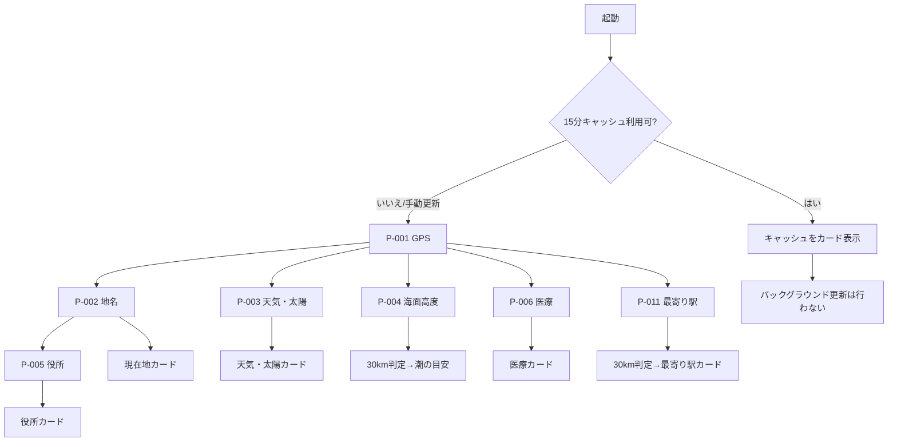

# 外部API・処理設計

## 1. 方針

本システムは独自APIを公開しない。ここではブラウザAPI、外部API、静的JSON、端末内処理の契約を定義する。各提供元はアダプターで分離し、UIは正規化されたdomain型だけを参照する。

## 2. 処理一覧

| 処理ID | 処理 | 種別 | 対応機能ID |
|---|---|---|---|
| P-001 | GPS取得 | Browser API | FR-002〜FR-004 |
| P-002 | 逆ジオコーディング | 外部API | FR-003 |
| P-003 | 天気・太陽・概算標高取得 | 外部API | FR-005、FR-006、FR-017 |
| P-004 | 海面高度取得・潮汐候補抽出 | 外部API＋端末内計算 | FR-007 |
| P-005 | 自治体・役所照合 | 静的JSON＋端末内計算 | FR-008 |
| P-006 | 医療機関検索 | 静的JSON＋端末内計算 | FR-009 |
| P-011 | 最寄り駅検索 | 静的JSON＋端末内計算 | FR-016 |
| P-007 | カード調停・タイムアウト | 端末内処理 | FR-010〜FR-012 |
| P-008 | 共有・コピー | Browser API | FR-013 |
| P-009 | 保存・全消去・移行 | Browser Storage | FR-011、FR-014 |
| P-010 | PWA導入・更新 | Browser Install API、Service Worker | FR-001、FR-015 |

## 3. 全体の呼び出し順



各枝は独立して完了・失敗できる。Promise.allで全件完了を待ってから表示する実装は禁止する。

## 4. P-001 GPS取得

### ブラウザAPI

navigator.geolocation.getCurrentPositionを使用する。

| オプション | 値 |
|---|---|
| enableHighAccuracy | true |
| timeout | 15000ms |
| maximumAge | 初回・手動更新は0。起動時キャッシュ判定はアプリ側で行う |

### 成功

- 緯度、経度、accuracy、取得時刻を検証する。
- 生座標はメモリー内の距離計算に使う。
- 永続化前に小数点以下4桁へ丸める。
- 同一の取得操作を連打しても、進行中Promiseを再利用する。

### 失敗コード

| コード | 条件 | UI文言 | 回復 |
|---|---|---|---|
| GEO_PERMISSION_DENIED | 許可拒否 | 位置情報が許可されていません | 端末設定案内、再試行 |
| GEO_POSITION_UNAVAILABLE | 測位不能 | 現在地を確認できませんでした | 場所を移動して再試行、前回値 |
| GEO_TIMEOUT | 15秒で未確定 | 現在地の確認に時間がかかっています | 再試行、前回値 |
| GEO_UNSUPPORTED | API非対応 | この端末では現在地を取得できません | 利用不能案内 |
| GEO_INVALID_COORDINATE | 値が範囲外 | 現在地の値を利用できません | 再試行 |

## 5. P-002 逆ジオコーディング

### エンドポイント

GET https://mreversegeocoder.gsi.go.jp/reverse-geocoder/LonLatToAddress

### リクエスト

| パラメーター | 値 |
|---|---|
| lat | 生座標を小数点以下4桁へ丸める |
| lon | 生座標を小数点以下4桁へ丸める |

例: ?lat=35.6812&lon=139.7671

### 期待レスポンス

```json
{
  "results": {
    "muniCd": "13101",
    "lv01Nm": "丸の内一丁目"
  }
}
```

### 正規化

1. Zodでresults、muniCd、lv01Nmを検証する。
2. muniCdをMunicipalityRecordへ照合し、都道府県、市区町村、区階層を得る。
3. lv01Nmを町丁目として連結する。
4. muniCdがマスターにない場合は地名カードを部分表示し、マスター不一致を記録する。ログへ座標は含めない。

### 失敗

| コード | 条件 | UI文言 | 回復 |
|---|---|---|---|
| PLACE_NETWORK_ERROR | 通信失敗 | 地名を取得できませんでした | 前回値、カード再試行 |
| PLACE_TIMEOUT | 10秒超 | 地名の取得に時間がかかっています | 前回値、カード再試行 |
| PLACE_SCHEMA_ERROR | 形式不正 | 地名データを読み取れませんでした | 座標以外の取得済みカードを維持 |
| PLACE_MUNICIPALITY_UNKNOWN | コード不明 | 行政区域を確認できませんでした | 町丁目があれば表示、再試行 |

## 6. P-003 天気・太陽・概算標高取得

### エンドポイント

GET https://api.open-meteo.com/v1/forecast

### 座標

緯度経度を小数点以下2桁へ丸める（日本付近で約1km）。

### パラメーター

| パラメーター | 値 |
|---|---|
| latitude / longitude | 丸めた座標 |
| current | temperature_2m,apparent_temperature,weather_code |
| hourly | temperature_2m,precipitation,weather_code |
| daily | temperature_2m_max,temperature_2m_min,sunrise,sunset |
| forecast_days | 2 |
| timezone | Asia/Tokyo |
| timeformat | unixtime |

### 正規化

- current、hourly、dailyの配列長と単位を検証する。
- 現在のUnix秒以降から6時間分を選ぶ。
- Unix秒をUTC ISO 8601へ変換して保存し、表示時にJSTへ変換する。
- 今日の行は端末の現在瞬間をAsia/Tokyoへ変換したローカル日付で選ぶ。
- `hourly.precipitation`は表示時刻までの直前1時間の予想降水量として保持する。同じJST日に属する時間別値の最大を今日の最大1時間予想降水量とし、確率へ換算しない。
- 日の出・日の入りは同じ応答からSolarSummaryへ分離する。
- ルート応答の`elevation`を有限数として検証し、WeatherSummary.elevationMetersへ保持する。90m解像度の地形モデル由来なので整数mへ丸め、「約」「概算」を付けて現在地カードへ表示する。
- `elevation`欠損・不正時は概算標高だけを非表示にし、天気、太陽、現在地カードの既存情報を失敗させない。標高専用APIは呼び出さない。
- WMOコードと日本語ラベルの対応はコード内の固定表とし、未知コードは「天気情報」とする。

### 失敗コード

WEATHER_NETWORK_ERROR / WEATHER_TIMEOUT / WEATHER_SCHEMA_ERROR / WEATHER_NO_CURRENT / WEATHER_NO_DAILY を使う。天気と太陽は同一通信でも正規化を分離し、dailyだけ欠損した場合は天気カードを維持して太陽カードだけ失敗にする。

## 7. P-004 海面高度・潮の目安

### エンドポイント

GET https://marine-api.open-meteo.com/v1/marine

### パラメーター

| パラメーター | 値 |
|---|---|
| latitude / longitude | 小数点以下2桁へ丸めた座標 |
| hourly | sea_level_height_msl |
| past_hours | 6 |
| forecast_hours | 36 |
| cell_selection | sea |
| timezone | Asia/Tokyo |
| timeformat | unixtime |

### 30km判定

- APIレスポンスのlatitude/longitudeをモデル格子中心として扱う。
- 生GPS座標とモデル格子中心のHaversine距離を計算する。
- 30,000mを超える場合はTIDE_TOO_FARとしてnot_applicableにする。
- APIが値を返しても、格子座標欠損または全値nullなら表示しない。

### 極大・極小の抽出

この処理は決定的な純粋関数として実装する。

1. 時刻昇順、有限値だけに正規化する。
2. 3点の中央移動平均を作り、端点は候補にしない。
3. 前後より大きい点をhigh、前後より小さい点をlow候補にする。
4. 3時間以内に同種候補が複数ある場合、highは最大値、lowは最小値だけを残す。
5. high同士、low同士が連続した場合は、より極端な候補を残してhigh/lowを交互にする。
6. 現在以降30時間の候補を時刻順に最大4件返す。
7. 候補が2件未満ならTIDE_INSUFFICIENT_SERIESとする。

海面高度は潮汐、気圧、海面変動等を含むため、抽出結果は「満潮／干潮の目安」であり、天文潮位ではない。

### 失敗コード

TIDE_NETWORK_ERROR / TIDE_TIMEOUT / TIDE_SCHEMA_ERROR / TIDE_TOO_FAR / TIDE_INSUFFICIENT_SERIES を使う。TOO_FARは利用者エラーではなく対象外状態とする。

## 8. P-005 自治体・役所照合

座標・名称はアマノ技研の全国市町村役場データ（2026-01-15）を基礎にし、自治体の公式確認先はデジタル庁の地方公共団体オープンデータ一覧とJ-LISを併用してビルド時に静的化する。実行時は外部の役所検索APIへ座標を送らない。

### 入力

- PlaceSummary.municipalityCode
- 生GPS座標
- src/data/municipalities.generated.json、public/data/government/offices.json

### 処理

1. 自治体コードから所属都道府県と管轄役所を得る。
2. 都道府県庁を得る。
3. designated-wardなら区役所をjurisdictionOffice、親市役所をparentCityOfficeにする。
4. 生GPSから各庁舎までの直線距離と初期方位角を計算する。
5. 8方位と矢印へ正規化する。
6. 公式URLがhttpsでない、座標が日本の概略範囲外ならレコードを拒否する。

失敗コード: GOVERNMENT_MASTER_MISSING / GOVERNMENT_OFFICE_MISSING / GOVERNMENT_DATA_INVALID。

## 9. P-006 医療機関検索

### 静的ファイル取得

1. manifest.jsonを読み、dataVersionと0.25度グリッドを確認する。
2. 10km円の外接矩形と交差するgridIdを列挙し、ファイルを並行取得する。
3. Haversine距離で10km以内を絞り、区分ごとに距離順にする。
4. 病院・一般診療所が各3件未満なら、30km外接矩形の不足グリッドを追加取得する。
5. 全区分を30km以内で再計算し、病院、一般診療所、歯科、薬局、助産所を各3件まで返す。
6. 同じ施設IDは1件に重複排除する。

### 外部導線

- officialUrlが有効なら「公式サイト」を表示する。
- sourceDetailUrlがあれば医療情報ネット詳細を表示する。
- どちらもなければ医療情報ネットの検索入口を表示する。
- 地図URLは施設座標だけを含め、利用者の現在地を含めない。

### 失敗コード

MEDICAL_MANIFEST_ERROR / MEDICAL_SHARD_MISSING / MEDICAL_SCHEMA_ERROR / MEDICAL_EMPTY を使う。個別シャード欠損時は取得済み範囲の結果を「一部取得できませんでした」と表示し、全体を破棄しない。

## 10. P-011 最寄り駅検索

### ビルド時生成

1. 国土交通省「国土数値情報（鉄道時系列データ）」N05の最新版を取得する。
2. Station2のうち設置終了年が9999の旅客駅を採用し、貨物駅・信号場・操車場・索道を含めない。変遷備考等で休止と確認できる駅も除外し、除外理由を生成レポートへ残す。
3. 同じ正規化駅名かつ座標間200m以内のレコードを1駅グループにまとめる。
4. 路線名、運営会社、事業者種別を重複排除し、0.25度グリッドJSONとmanifestを生成する。
5. 原典件数、除外件数、重複関係ID、座標範囲、200m境界、データ基準日、非商用条件、出典を検証する。

### 端末内検索

1. stations/manifest.jsonを読み、dataVersion、schemaVersion、usageRestrictionを検証する。
2. 30km円の外接矩形と交差するgridIdを列挙し、必要な静的JSONだけを並行取得する。
3. 駅グループ代表座標までのHaversine直線距離を計算し、30km以内へ絞る。
4. 距離、駅名、駅IDの順で安定ソートし、最寄り1件と次候補2件を返す。
5. 各候補の初期方位角を8方位へ変換する。

### 外部導線

- 地図URLには駅グループの代表座標と駅名だけを含め、利用者の現在地は含めない。
- 時刻表、運行状況、徒歩距離、所要時間を構成・推定しない。
- 30km以内0件はSTATION_EMPTYとして正常な空状態を返す。

### 失敗コード

STATION_MANIFEST_ERROR / STATION_SHARD_ERROR / STATION_SCHEMA_ERROR を使う。個別シャード欠損時は取得済み範囲を表示せず、カード単位で再試行する。最寄り駅の誤順位を避けるため、部分データを完全な検索結果として扱わない。30km以内0件は例外ではなく空配列で返す。

## 11. P-007 カード調停

### タイムアウト・再試行

- 外部fetchはAbortControllerで10秒タイムアウト。
- ネットワークエラー、タイムアウト、または5xxだけ、直ちに1回自動再試行する。
- 4xx、スキーマ不正、対象外は自動再試行しない。
- 10秒の試行を最大2回とし、最大20秒後はカード単位の失敗または前回値へ移す。
- 手動再試行はそのカードだけを再取得する。
- 手動の画面更新は15分キャッシュをバイパスするが、進行中の同一要求を重複発行しない。

### キャッシュ優先順位

1. 距離・15分条件を満たすfresh cache
2. 新規取得成功
3. 新規取得失敗時の24時間以内stale snapshot
4. エラー表示

前回値を使うときは状態をstaleへし、freshへ偽装しない。

## 12. P-008 共有

### 共有本文

- 正式サービス名
- 利用者が選択した地名、確認時刻、天気、日の出／日の入り、潮の目安、役所
- アプリ入口URL
- 緯度経度、GPS精度、医療機関名は含めない

### 処理

1. navigator.shareがあれば共有する。
2. AbortErrorは利用者キャンセルとしてエラー表示しない。
3. 非対応またはコピー選択時はnavigator.clipboard.writeTextを使う。
4. 失敗時はSHARE_CLIPBOARD_DENIEDとして手動コピー欄を表示する。

共有は書き込みサーバーを伴わないため、二重実行でアプリ内データは変化しない。

共有URLは誰でも開ける通常のアプリ入口であり、認証、有効期限、取消はない。位置や選択内容をサーバーへ保存して復元する共有方式はMVP対象外とする。

## 13. P-009 保存・全消去

- IndexedDBトランザクションで各ストアを削除する。
- localStorageの設定を初期値へ戻す。
- 同時に複数回実行しても成功とする。
- 一部削除失敗時はSTORAGE_CLEAR_FAILEDとし、どこまで削除したかを位置情報なしで記録する。
- 24時間期限は起動時、読込時、保存時に検査する。

## 14. P-010 PWA導入・更新

- 起動時に`display-mode: standalone`とiOS／iPadOS相当を判定する。iOS／iPadOSはSafariの共有手順を案内し、自動で共有シートを開かない。
- Android／PCでは`beforeinstallprompt`を`preventDefault()`して一時保持し、利用者が「インストール」を選んだ場合だけ`prompt()`を呼ぶ。イベントがないブラウザへ代替ボタンを出さない。
- `appinstalled`後は導入済みへ遷移する。ブラウザ状態は`waiting`／`ios`／`installable`／`installed`へ正規化し、React画面へブラウザ固有イベントを直接渡さない。
- 閉じる、またはインストール要求後は`AppSettings.installPromptSeen`をtrueにする。例外時も通常画面を維持し、全消去時は他設定と同時に解除する。
- vite-plugin-pwaの更新通知方式を使い、待機中Service Workerを画面で案内する。
- 利用者の「更新する」操作後にskipWaiting相当を実行し、controllerchange後に1回だけ再読込する。
- app shellはprecache、外部APIはService Workerで無期限キャッシュしない。
- 静的マスターは版付きURLとし、Cache First＋版変更時置換とする。
- noindexはmeta robotsとX-Robots-Tag相当の配信設定を併用する。

## 15. 安定エラーコードと文言

コードはテストと内部状態で安定させ、画面文言は日本語辞書で別管理する。例外オブジェクトやURLをそのまま利用者へ表示しない。

| 分類 | コード例 | 利用者向け文言 | 再試行 |
|---|---|---|---|
| 権限 | GEO_PERMISSION_DENIED | 位置情報が許可されていません | 設定変更後 |
| 通信 | WEATHER_NETWORK_ERROR | 天気を取得できませんでした | 可 |
| 時間 | WEATHER_TIMEOUT等 | 取得に時間がかかっています | 可 |
| 形式 | MEDICAL_SCHEMA_ERROR | 医療データを読み取れませんでした | 更新後 |
| 静的データ | STATION_SHARD_ERROR | 周辺の駅データを読み込めませんでした | 可 |
| 対象外 | TIDE_TOO_FAR | 潮の目安の対象地域ではありません | 不要 |
| 保存 | STORAGE_CLEAR_FAILED | 保存データをすべて消去できませんでした | 可 |
| 共有 | SHARE_CLIPBOARD_DENIED | 自動コピーできませんでした | 手動コピー |

## 16. 主要異常系

| 条件 | 外部・保存側 | クライアント動作 | 冪等性・競合 | 回復方法 | テスト |
|---|---|---|---|---|---|
| 更新ボタン連打 | 同一要求を共有 | ボタンを進行表示 | in-flightキーで重複抑止 | 完了後再操作 | 10連打で要求1組 |
| API 5xx | 1回だけ再試行 | 他カードを維持 | 読み取りのみ | 前回値／手動再試行 | 2回失敗でerror |
| 最大2回の取得失敗 | Abort可能な要求を停止 | カード固有エラー | 古い応答を採用しない | 再試行 | 遅延応答が画面を上書きしない |
| 医療シャード一部欠損 | 取得済みを保持 | 一部欠損表示 | 施設ID重複排除 | 再取得 | 1ファイル404でも結果表示 |
| 駅シャード一部欠損 | 不完全結果を採用しない | 駅カードだけ失敗 | 進行中要求を共有 | カード再試行／前回値 | 1ファイル404で誤った最寄り駅を表示しない |
| 24時間期限切れ | キャッシュ削除 | 未取得／エラー | 削除は冪等 | 新規取得 | 境界前後を時計固定で検証 |
| PWA更新中 | 旧版を動作継続 | 更新通知 | controllerchangeを1回処理 | 新版再読込 | 二重再読込なし |
| インストール非対応／導入済み | ブラウザ機能なし／standalone | 案内を表示しない | 状態判定は冪等 | URLから通常利用 | 偽の導入操作がない |
| インストール要求例外 | ブラウザ要求失敗 | 案内を閉じ通常画面を維持 | 表示済みを保存 | URLから継続利用 | 全画面エラーにしない |
| 全消去連打 | 既に空でも成功 | 完了通知1回 | 削除は冪等 | 未取得状態 | 2並行実行で残存0 |

## 17. CSP接続先

connect-srcはself、mreversegeocoder.gsi.go.jp、api.open-meteo.com、marine-api.open-meteo.comだけを許可する。画像・フォントはselfとdataに限定し、外部追跡資産を読み込まない。`public/_headers`でCSP、X-Robots-Tag、Referrer-Policy、Permissions-Policy、nosniff、COOPを配信する。

## 18. 提供元検証

- ビルド時に公式APIの固定fixtureとZodスキーマを照合する。
- 本番E2Eは外部APIを直接不安定に呼ばず、通常はfixtureで行う。
- リリース前の手動smokeで実APIを各1地点確認する。
- 海面高度抽出は気象庁の代表地点別満干潮時刻とも参考突合する。ただし同値を要求せず、high/low順序と大幅な時刻乖離を検知する。
- 駅データは国土数値情報N05のStation2属性と突合し、代表駅について駅名、路線、運営会社、座標、現存扱いを原典および鉄道事業者公式サイトで確認する。
- 移植元ロジックはない。距離、方角、極値抽出は本案件で純粋関数として新規実装する。
