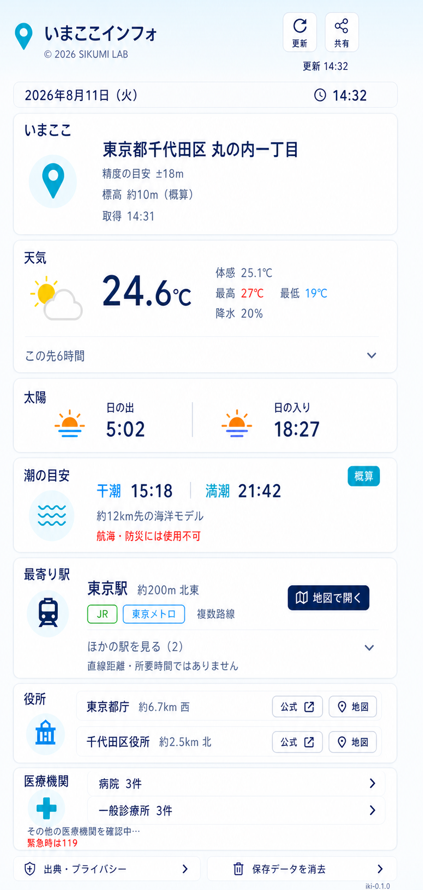
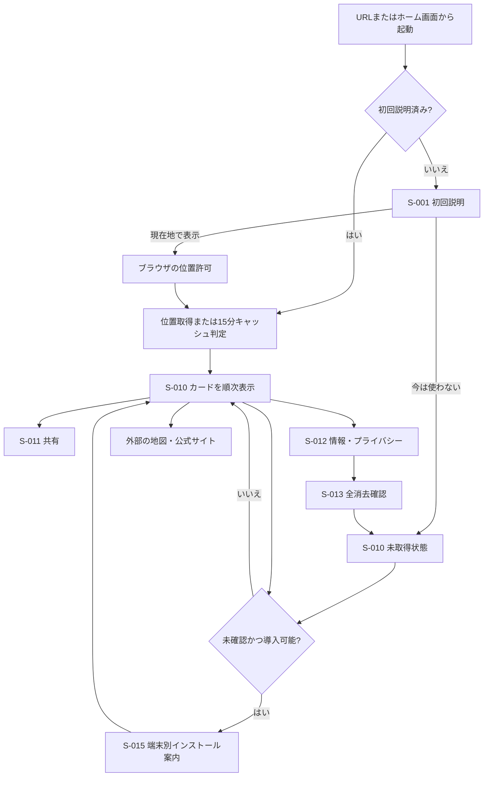

# 画面設計

## 1. 画面方針

「一画面」は、ページ遷移せず1つのダッシュボードで確認できることを意味する。スマートフォンでは縦スクロールを許容し、重要度順にカードを並べる。埋め込み地図や多階層メニューは設けない。

## 2. ビジュアル方針

- 主タイトル: 「いまここインフォ」。屋号を前置しない
- 運営表記: 主タイトル直下に「© 2026 SIKUMI LAB」を小さく控えめに表示
- 基調色: 空色、紺、海色。天気に陽光色、太陽に朝夕の橙、駅・役所に青、医療に緑を淡いカード背景と見出しアイコンへ限定して使う
- 形状: 角丸カード、明確な見出し、控えめな境界線
- テーマ: 明るいテーマを基本とし、prefers-color-schemeに応じてダークテーマへ切替
- ダークテーマでもカード見出しアイコン、駅・役所・医療の操作リンク、役所名を背景から判読できる配色にする
- 文字: アプリへ同梱した小杉ゴシック（Kosugi Gothic）。読み込めない場合は日本語サンセリフ系システムフォントへフォールバックし、端末の文字拡大を妨げない
- フォント配信: 実行時にGoogle Fonts等へ接続せず、同梱したWebフォントを同一オリジンから配信する
- 写真: 使用しない
- アイコン: 外部素材や絵文字へ依存しないアプリ内カラーSVGで統一する。天気・太陽・潮・駅・役所・医療・主要操作の意味を補助し、必ず文字ラベルを併記。PWA通常アイコンは角丸外を透過し、maskableアイコンは背景全面を塗った別資産にする
- 動き: 短いフェードとスケルトン。prefers-reduced-motion時は動きを停止

### 2.1 画面モック v4（旧構成の参照）

- 対象: S-010 現在地ダッシュボードのライトモード、東京駅周辺の表示例
- カード順は旧構成のため、実装・受入では6.2の順序を正とする
- 確認対象: 主タイトルと運営表記の階層、同じサイズ・太さの現在日付と時計、小杉ゴシック、概算標高、情報順、カード密度、空色・紺・海色の配色、最寄り駅カード、医療カードの段階読み込み
- モック内の数値・地点・文言はレイアウト確認用の例であり、実データや最終文言を保証しない。
- この画像の承認は情報構造と視覚方針の承認とし、実装後のDOM・CSS・対象viewport確認は別途行う。
- v1〜v3は変更履歴として`mockups/`に保持する。

## 3. 画面一覧

| 画面ID | 名称 | 形式 | 対応機能ID |
|---|---|---|---|
| S-001 | 初回説明 | 初回だけのモーダル／全面シート | FR-002、FR-014、FR-015 |
| S-010 | 現在地ダッシュボード | 主画面 | FR-001〜FR-013、FR-015〜FR-017 |
| S-011 | 共有内容 | ボトムシート／ダイアログ | FR-013 |
| S-012 | 情報・プライバシー | ボトムシート／別領域 | FR-014、FR-015 |
| S-013 | 保存データ全消去確認 | 確認ダイアログ | FR-014 |
| S-014 | アプリ更新通知 | トースト／バナー | FR-001、FR-011、FR-015 |
| S-015 | PWAインストール案内 | 初回だけのダイアログ | FR-001 |

## 4. 画面遷移

## 5. S-001 初回説明

### 表示

- サービス名と短い説明
- 位置情報を、地名・天気・距離等の取得に使うこと
- 国土地理院系、Open-Meteoへ用途に応じて丸めた座標を送ること
- 生の位置履歴、アカウント、アクセス解析を持たないこと
- 最新1件を端末内へ最大24時間保存すること
- 「現在地で表示」「今は使わない」
- 情報・プライバシー詳細へのリンク

### 操作

- 「現在地で表示」後にだけブラウザの位置許可を要求する。
- 「今は使わない」では許可を要求せず、S-010の未取得状態へ進む。
- ブラウザ許可を拒否してもS-010へ進み、理由と再試行導線を示す。

### アクセシビリティ

- 初期フォーカスは見出し。閉じた後は起点ボタンへ戻す。
- Escape、戻る操作、画面外タップの扱いを統一し、意図せず許可を要求しない。

## 6. S-010 現在地ダッシュボード

### 6.1 ヘッダー

- 主タイトル「いまここインフォ」
- 主タイトル直下に小さく控えめな「© 2026 SIKUMI LAB」
- 現在日付「YYYY年M月D日（曜）」と現在時計「HH:mm」
- 現在日付と時計は同じ文字サイズ・太さにする
- 410px前後のスマートフォン幅では日付・時計を18px以上で表示し、テーマ選択の下端から日付カードまでと、日付カードから現在地カードまでの間隔を同程度に揃える
- 現在時計は画面表示中に毎分更新し、日付はJSTの0時に更新する
- 情報の最終更新時刻は「更新 HH:mm」として現在時計から分離する
- 更新ボタン
- 共有ボタン
- GPS取得中は「現在地を確認中」と進行表示
- 時計更新だけでスクリーンリーダーへ毎分割り込み通知しない。日付と時刻は`time`要素で機械可読な日時を持たせる。

### 6.2 カード順

| カードID | 名称 | 主な表示 | 対応機能ID |
|---|---|---|---|
| C-001 | 現在地 | 都道府県、市区町村、町丁目、GPS精度、概算標高、右上の取得時刻、境界注意 | FR-002〜FR-004、FR-017 |
| C-008 | 最寄り駅 | 最寄り1駅、次候補2駅の開閉、路線、運営会社、距離、方角、各駅の地図 | FR-016 |
| C-002 | 天気 | 天気、現在気温、体感、最高／最低、降水確率、6時間予報の開閉 | FR-005 |
| C-003 | 太陽 | 日の出、日の入り、日付 | FR-006 |
| C-004 | 潮の目安 | 満潮／干潮の目安、モデル地点距離、概算免責 | FR-007 |
| C-005 | 役所 | 都道府県庁、管轄役所、市役所補助導線、距離、方角、公式／地図 | FR-008 |
| C-006 | 医療機関 | 病院3、一般診療所3、歯科・薬局・助産所各3の開閉、距離、方角、公式／地図 | FR-009 |
| C-007 | 状態と出典 | データ基準日、各提供元、免責、アプリ版、情報画面 | FR-011、FR-012、FR-015 |

### 6.3 カード共通状態

| 状態 | 表示 | 操作 |
|---|---|---|
| idle | 「現在地で表示」または未取得案内 | 位置取得開始 |
| loading | スケルトン＋「天気を取得中」等の文言 | 他カードは操作可。更新の連打は抑止 |
| fresh | 値、取得時刻 | 更新、展開、外部リンク |
| cached | 値＋「15分以内の保存情報」 | 手動更新可 |
| stale | 値＋「前回の情報」＋取得時刻 | 新規取得の再試行 |
| error | 短い原因、利用者ができること | カード単位の再試行 |
| not_applicable | 原則カードを隠す。潮汐は必要時だけ理由を表示 | なし |

20秒を超えた処理はloadingのままにせず、CARD_TIMEOUT状態へ移して再試行と前回値を提示する。

### 6.4 現在地カード

- 住所文字列は可変長で折り返す。省略だけで終わらせない。
- 320px以上では現在地ピンの左列と住所本文の右列を維持し、現在地と最寄り駅の「地図」は同じコンパクトな寸法・右端位置に揃える。
- 住所情報の取得時刻はカード右上へ置き、住所本文の下に独立行を増やさない。
- GPS精度は「精度の目安 ±○m」とする。
- 天気API応答に標高があれば「標高 約○m（概算）」と表示する。欠損・不正時は標高行だけを隠し、地名とGPS精度は維持する。
- GPS精度と概算標高は同一行へ配置し、狭幅時だけ折り返す。
- 標高は90m解像度の地形モデル由来であり、防災・登山・測量用途には使わない旨を出典・免責で示す。
- 精度が250mを超える場合、または短時間の再測位で自治体コードが変わる場合は「行政区域の境界付近、または測位精度が低い可能性」を表示する。
- 緯度経度は標準表示しない。

### 6.5 天気・太陽カード

- 現在の天気はWMOコードに応じたアプリ内SVG（晴れ、晴れ時々くもり、くもり、霧、雨、雪、雷雨）と日本語ラベルを併記する。未知コードは中立的なくもりアイコンと「天気情報」で表示する。
- 体感、最高、最低、降水の補足値は通常のスマートフォン幅で横一列にし、値の縦位置を揃える。
- 直近6時間は開閉式。各時刻に気温、簡潔な天気状態（晴れ、くもり、雨、雪、雷雨）、降水確率を併記する。6件を時系列の小カードで横並びにし、狭い画面ではカード内だけを横スクロールできるようにする。
- 今日の降水確率には「※降水の％は今日の最大値です。」を常時表示する。6時間予報の展開時だけ、その時間別一覧の下に「※時間別の％は直前1時間の降水確率です。」を表示する。どちらも補足情報の青色と共通注釈サイズを用いる。
- 取得時刻と予報対象時刻を分ける。
- 日の出・日の入りはJSTの24時間表記とし、潮の目安と同じ`HH:mm`形式で時を0埋めする。2つの時刻は潮の目安と同じ左右列の中心位置へ揃える。

### 6.6 潮汐カード

- 「潮の目安」と表示し、「潮汐」「正確な潮位」と強く断定しない。
- 直近の干潮・満潮候補を時刻順に最大4件表示する。
- 海面高度値は内部検証に保持するが、MVP画面では時刻を主表示とし、数値を潮位として強調しない。
- 「※約○km先の海洋モデル」「予測値」「航海・防災には使用不可」を常時表示する。
- モデル地点距離と注意書きはカード末尾の同一行へ配置し、狭幅時だけ折り返す。
- モデル格子が30km超なら潮の値を表示せず、「近くに対象の海洋データがないため、潮の目安は表示していません」と理由を案内する。

### 6.7 最寄り駅カード

- 最寄り1駅を最初から表示し、「ほかの駅を見る」で次候補2駅を展開する。
- 最寄り駅と展開後の次候補それぞれに、駅名、路線名、運営会社、直線距離、方角、「地図」を表示する。
- スマホでは最寄り駅と展開後の次候補の名称開始位置を揃え、PCの余白は変更しない。
- 同名かつ近接する複数路線の駅は1件へまとめ、路線名・運営会社を複数表示する。
- 距離は駅グループの代表座標までの直線距離とし、「徒歩距離・所要時間ではありません」とカード内に表示する。
- 「ほかの駅を見る」と距離の注意書きは同一行へ配置し、カードの縦幅を抑える。
- 30km以内に候補がない場合は「30km以内に駅は見つかりませんでした」と表示する。
- 静的データの欠損・読込失敗時は駅カードだけをerrorにし、再試行とデータ基準日を表示する。
- 時刻表、リアルタイム運行、改札・出口、徒歩ルートは表示しない。
- データ基準日と「現在の営業・運行を保証しません」をカード末尾に表示する。

### 6.8 役所カード

- 県庁と管轄役所をそれぞれ1行カードにする。
- 表示: 名称、直線距離、方角、「公式サイト」「地図で開く」。
- 住所、電話、開庁時間は表示しない。
- 政令指定都市の区では区役所を主表示、市役所を「市役所も見る」として補助表示する。

### 6.9 医療機関カード

- 病院と一般診療所は各3件を最初から表示する。
- 歯科診療所、薬局、助産所は区分ごとの開閉ボタンで各3件まで表示する。
- 10kmで各主要区分が3件未満なら30kmへ拡張し、「30km圏まで広げています」と示す。
- 0件の場合は「この範囲では見つかりませんでした」と表示し、医療情報ネットへのリンクを示す。
- 各行: 名称、種別、直線距離、方角、公式サイトまたは医療情報ネット、地図。
- スマホの施設名称は最寄り駅・次候補と同じ開始位置へ揃え、カード見出しから先頭区分までの間隔は役所カードと揃える。
- 「現在診療中」「救急受入可能」を表示しない。
- カード末尾に「緊急時は119へ」「受診前に公式情報で確認」を固定表示する。
- 420px以下では受診前注記を1段目、2段目の左に「緊急時は119へ」、右に「医療情報ネットで確認」を折り返さず表示する。

### 6.10 フッター

- 情報・プライバシー
- 保存データを消去
- 出典
- 駅データ基準日
- アプリ版 mvp-0.2.3
- noindexであっても公開URLである旨

## 7. S-011 共有内容

### 表示

- 共有内容のプレビュー
- 選択項目: 現在地名、確認時刻、天気、日の出／日の入り、潮の目安、役所
- 初期選択: 現在地名、確認時刻、天気、日の出／日の入り
- 医療機関、GPS精度、緯度経度は共有対象外
- ページURLを末尾に追加

### 操作

1. Web Share APIが使える場合は端末共有を開く。
2. 非対応または利用者がコピーを選んだ場合は本文＋URLをClipboard APIでコピーする。
3. クリップボードも失敗した場合は、選択可能なテキスト欄を表示して手動コピーを案内する。
4. 成功、利用者キャンセル、失敗を別の文言で通知する。

共有URLに位置や選択内容をクエリとして埋め込まない。URLは通常のアプリ入口であり、受信者側で共有者の位置を復元できない。

共有範囲は公開URLで、認証はない。サーバーへ共有レコードを作らないため、有効期限・取消・権限切れは対象外とする。共有後に残るのは、利用者が選んだ端末側アプリへ渡した文字列だけである。

## 8. S-012 情報・プライバシー

- サービス説明
- 送信先と目的
- 保存する情報、保存しない情報、最大24時間
- データ全消去への導線
- 医療・潮汐免責
- データ提供元、利用条件へのリンク
- 医療・役所・駅データ基準日
- アプリ版

## 9. S-013 保存データ全消去確認

- 削除対象を列挙する。
- 「消去する」「戻る」を明確に分ける。
- 実行中の二重タップを抑止する。
- 成功時は未取得状態へ戻り、「端末内の保存データを消去しました」と表示する。
- 失敗時は画面を維持し、再試行とブラウザのサイトデータ削除案内を示す。

## 10. S-014 アプリ更新通知

- 新しいService Worker待機時に「新しい版があります」を表示する。
- 「更新する」で新版を有効化して再読込する。
- 「あとで」で現在の操作を継続する。
- 強制再読込で表示中の結果を突然失わせない。
- 保存形式非互換時は、安全にキャッシュを破棄して再取得する旨を示す。

## 11. S-015 PWAインストール案内

- S-001の初回位置説明が完了し、既存ダイアログが閉じている場合だけ表示する。
- iPhone／iPadでは「Safariで共有を開き、『ホーム画面に追加』を選ぶ」手順と「わかりました」を表示する。
- Android／PCではブラウザの`beforeinstallprompt`を受け取った場合だけ「今はしない」「インストール」を表示する。
- standalone起動済み、表示済み、非対応ブラウザでは表示しない。
- 閉じる、Escape、背景操作、インストール操作のいずれでも表示済みとして端末設定へ保存する。
- 見出し参照を持つモーダルダイアログとし、初期フォーカスを主操作へ置く。主要操作は44px以上、ライト／ダークの双方へ追従する。
- 設定の全消去後は未確認へ戻り、次回条件を満たす場合に再表示できる。

## 12. レスポンシブ

| 幅 | 設計 |
|---|---|
| 320〜599px | 1列、左右16px目安、下部操作が端末UIと重ならない |
| 600〜1023px | 重要カードは1列、短いカードは2列可 |
| 1024px以上 | 最大幅960px程度、天気／太陽、役所／医療を読みやすく2列配置可 |

主要操作はスマートフォンとPCの両方で完結させる。ホバーだけで情報を出さない。

## 13. 画面遷移完全性

| 画面・状態 | 入口 | 正常な次 | 戻る | 中断時 | 空状態 | エラー後の回復 |
|---|---|---|---|---|---|---|
| S-001 初回 | 初回起動 | 許可後S-010 | 今は使わない→S-010 | 許可要求前なら安全に閉じる | 説明を表示 | 拒否→S-010で再試行 |
| S-010 未取得 | 起動、全消去 | カード順次表示 | アプリ終了 | 状態を保存しない | 現在地ボタン | 設定案内、再試行 |
| S-010 取得中 | GPS成功 | fresh/cachedカード | 他カード操作 | 20秒でtimeout | スケルトン | カード単位再試行／前回値 |
| S-010 表示済み | 取得成功 | 外部導線、共有 | 同画面 | 最新1件を保存 | 0件文言 | 他カード維持、個別再試行 |
| S-011 共有 | 共有ボタン | 成功通知 | S-010 | キャンセルは変更なし | 対象なしなら共有不可 | Clipboard→手動コピー |
| S-012 情報 | フッター | 外部出典／全消去 | S-010 | 変更なし | 該当なし | 外部リンク失敗を通知 |
| S-013 全消去 | S-012 | 未取得S-010 | S-012 | 確認前なら変更なし | 該当なし | 再試行／ブラウザ設定案内 |
| S-015 インストール案内 | S-001完了後または導入可能イベント | ブラウザ導入操作／S-010 | 今はしない→S-010 | Escape／背景操作→S-010 | 非対応・導入済みなら非表示 | 例外時もS-010を維持 |

## 14. 実画面確認条件

- 代表viewport: 320x568、390x844、768x1024、1440x900
- 文字倍率200%で主要情報と操作が欠落しない。
- ライト／ダーク、通常モーション／動き軽減を確認する。
- ダークテーマの主要カードアイコンと駅・役所・医療の操作文字は、実効背景に対して4.5:1以上のコントラストを自動検証する。
- 現在時計の分更新、JST 23:59→00:00の日付・曜日切替、バックグラウンド復帰後の時刻補正を確認する。
- 現在日付と時計の計算済みfont-size・font-weightが一致すること、小杉ゴシックが同一オリジンから読み込まれ、外部フォント通信がないことを確認する。
- 現在地の直後が最寄り駅、その後が天気、太陽、潮の目安、役所、医療機関の順であることをDOM順とキーボード読み上げ順の両方で確認する。
- 長い自治体名・駅名・施設名、駅／医療0件、30km拡張、カード5件同時エラーを確認する。
- モックの情報順承認と、実装後のDOM・CSS・実機表示確認を別の完了条件にする。
- iOS初回、Android／PCの`beforeinstallprompt`、再訪、standalone、非対応の各条件でS-015の表示有無を確認する。
