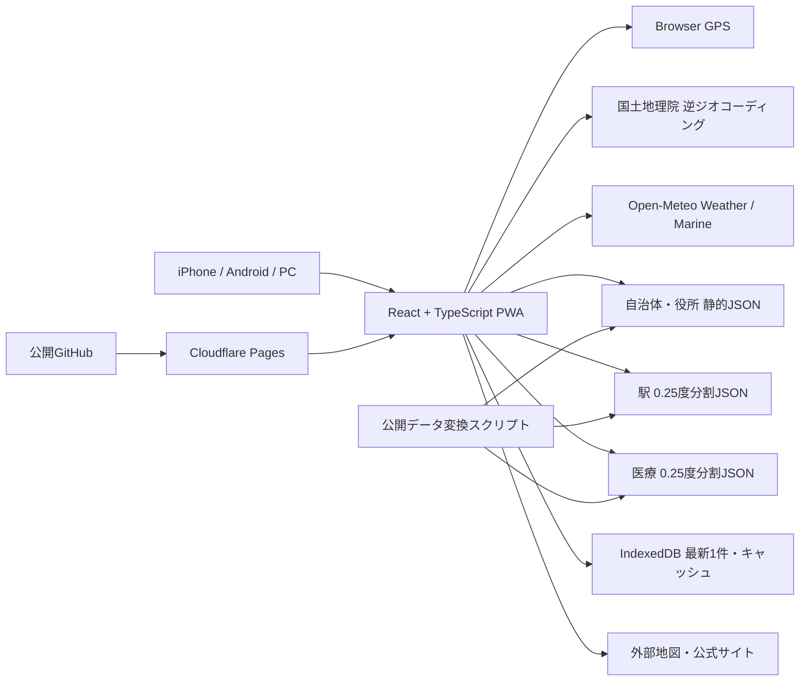

# シクミラボ「いまここインフォ」基本設計サマリ

## 1. 文書情報

| 項目 | 内容 |
|---|---|
| 文書ID | IKI-BD-001 |
| 版 | 1.9 |
| 作成日 | 2026-08-11 |
| 状態 | MVP実装・本番公開済み／mvp-0.2.1ローカル検証中 |
| 元要件 | 要件定義書_いまここインフォ.md 1.11 |
| 実装AI | Codex |
| 現在版 | mvp-0.2.1 |

## 2. 設計の要約

「いまここインフォ」は、スマートフォンのGPSを起点に、地名、概算標高、最寄り駅、天気、日の出・日の入り、概算潮汐、役所、医療機関を1つのダッシュボードへ順次表示する静的PWAとする。

独自サーバー、DB、ログイン、アクセス解析を持たず、全国共通データはビルド時に小さな静的ファイルへ変換する。外部サービスの1つが失敗しても、取得できたカードと24時間以内の前回値を残す。

## 3. 全体構成

## 4. 主要な設計判断

| 項目 | 決定 | 理由 | 区分 |
|---|---|---|---|
| 実装 | React＋TypeScript＋Vite | カードごとの状態分離、型検査、静的配信、AI実装の再現性 | 確定 |
| 実装環境 | Node.js 24 LTS、npm | 設計時点のActive LTSを使い、lockfileで固定 | 確定 |
| PWA | vite-plugin-pwaの更新通知方式＋端末別の初回導入案内 | オフラインと利用者選択による安全な新版切替に加え、iOSはSafari手順、Android／PCはブラウザ対応時だけ導入操作を示す | 確定・実装済み |
| 配信 | 公開GitHub`gerupon-lgtm/imacoco`→Cloudflare Pages | 実リポジトリの状態に合わせ、Previewと無料静的配信を利用 | 確定 |
| 地名 | 国土地理院系逆ジオコーダー＋自治体マスター | 日本の自治体コードを得られ、位置送信先を増やさない | 確定 |
| 役所 | アマノ技研の役場座標を基礎に、デジタル庁・J-LISの公式確認先を併用して静的化 | 全国を0円で網羅し、実行時検索と有料地図APIを避ける | 確定 |
| 最寄り駅 | 国土数値情報N05を現存旅客駅・0.25度グリッドへ変換 | 非商用・0円で利用でき、実行時に現在地を外部送信せず検索できる | 確定 |
| 医療 | 厚労省CSVを5区分・0.25度グリッドへ変換 | 検索サーバーなしで10km／30km検索を行える | 確定 |
| 潮 | Marine API海面高度の極大・極小 | 素早く0円で作れるが、必ず「目安」表示にする | 確定 |
| 概算標高 | Weather API応答の標高を現在地カードへ再利用 | 90m解像度の概算値を追加通信・追加費用なしで表示できる | 確定 |
| キャッシュ | 地名・役所・駅・医療250m、天気・海況1km、15分 | 行政境界や最寄り候補の誤再利用と不要通信のバランス | 確定 |
| 保存 | IndexedDBに最新1件、最大24時間 | 前回値を使いつつ位置履歴を作らない | 確定 |
| UI | 空・紺・海色を基調に、天気・太陽・公共交通・医療の意味色を淡いカード面へ付与。情報・操作アイコンはアプリ内カラーSVGで統一。角丸カード、システムダークモード | ブランドの親しみやすさとカードの判別性 | 確定 |
| ヘッダー | 主タイトル「いまここインフォ」、直下に「© 2026 SIKUMI LAB」、JSTの現在日付・時計 | サービス名と運営屋号を分離し、現在時点を一目で確認できるようにする | 確定 |
| 文字 | 小杉ゴシックをアプリへ同梱し、システム日本語サンセリフへフォールバック | 望む印象を保ち、外部フォント通信とオフライン欠落を避ける | 確定 |
| 共有 | 安全な項目選択、座標・医療名なし | 位置の不用意な漏えいを防ぐ | 確定 |
| 指定都市 | 区役所を主、市役所を補助 | 現在地の管轄窓口へ近づける | 確定・実装済み |

## 5. 画面構成

主画面は1つで、次のカードを上から表示する。

1. ヘッダーに主タイトル、運営表記、現在日付・時計、更新状態
2. 現在地・GPS精度・概算標高・GPS取得時刻
3. 現在と今日の天気・直近6時間
4. 日の出・日の入り
5. 潮の目安（海洋格子30km以内だけ）
6. 最寄り1駅、折りたたみ式の次候補2駅
7. 都道府県庁・管轄役所
8. 病院・一般診療所、折りたたみ式の歯科・薬局・助産所
9. 出典・データ基準日・免責・アプリ版

初回位置説明の完了後、未確認かつ導入可能な場合だけPWAインストール案内を重ねる。iOS／iPadOSはSafariの共有手順、Android／PCは`beforeinstallprompt`に基づく操作を示し、standalone・非対応・表示済みでは表示しない。

全カードは「取得中」「最新」「保存情報」「前回値」「失敗」「対象外」を個別に持つ。詳細はdocs/screens.mdを正とする。

## 6. データとプライバシー

- 生のGPSは処理中のメモリーだけで使う。
- 端末保存と国土地理院送信は小数点以下4桁、天気・海況送信は2桁へ丸める。駅検索は端末内で行い、外部送信を追加しない。
- 位置と表示結果は最新1件だけ、最大24時間。
- 15分を過ぎた値は現在値に見せず、「前回の情報」として扱う。
- 座標、閲覧履歴、利用者識別子をサーバーへ保存しない。
- 共有URLと共有本文に緯度経度を含めない。
- 全消去は冪等にし、実行後に利用者由来データが残らないことを検査する。
- インストール案内の表示済み状態だけを設定として保存し、位置や端末識別子は追加しない。全消去でこの状態も解除する。

## 7. 読み込みと障害対応

- 取得できたカードから順番に表示する。
- 外部通信は10秒で一度打ち切り、一時的なネットワーク／タイムアウトだけ1回再試行する。
- 最大20秒後はカード単位の失敗または24時間以内の前回値へ切り替える。
- 1つのAPI障害で画面全体を止めない。
- 新規取得失敗時は24時間以内の前回値を、取得時刻付きで提示する。
- 手動更新は短期キャッシュを使わず再取得するが、連打による重複要求は防ぐ。

## 8. 医療・潮汐の安全境界

### 医療

- 施設候補と公式確認先を示す機能であり、受診可否を判定しない。
- 「診療中」「救急受入可」を表示しない。
- 緊急時は119、受診前は公式情報で確認するよう常時表示する。

### 潮汐

- Open-Meteoのsea_level_height_mslは潮汐だけでなく気圧等の影響も含む。
- モデル格子の極大・極小を「満潮／干潮の目安」として表示する。
- 航海、漁業、防災、遊泳判断には使えないことを常時表示する。
- APIが返すモデル格子が現在地から30km超なら潮の値を表示せず、「近くに対象の海洋データがないため、潮の目安は表示していません」と理由を案内する。

### 最寄り駅

- 国土数値情報の2025年度版をビルド時に加工し、設置終了年が現存扱いの旅客駅だけを配布する。
- 同名かつ近接する駅をまとめ、最寄り1駅を主表示、次の2駅を折りたたみ表示する。
- 直線距離・方角であり、徒歩距離・所要時間・運行状況ではないことを表示する。
- 30km以内に候補がない場合は空状態とし、遠方駅や廃止駅を補完表示しない。

## 9. 入力品質ゲート結果

| 観点 | 結果 |
|---|---|
| 機能ID・目的・優先度 | FR-001〜FR-017をP0／MVP必須として要件1.5へ登録 |
| 性能・セキュリティ・運用 | 定義済み。全項目をタスクへ翻訳 |
| MVP・後続分離 | 定義済み |
| 初期状態・許可・入口 | 初回説明→GPS許可→段階表示として定義済み |
| 保存・期限・削除・復元 | 15分、24時間、最新1件、全消去、前版復元を定義済み |
| 状態・回復先 | カード7状態と主要異常系を定義済み |
| 設計ブロッカー | なし。MVP実装済み。残件は公開先・名称・PRマージの利用者判断 |

## 10. 要件との対応

全機能・非機能の画面、処理、データ、実装タスクへの対応はdocs/tasks.mdの「トレーサビリティ表」を正とする。

- FR-001〜FR-017: すべて1件以上のタスクへ割当済み
- NFR-P01〜NFR-P04: すべて性能・キャッシュ・E2Eタスクへ割当済み
- 非機能9.2〜9.8、運用10.2〜10.3: すべて実装・公開タスクへ割当済み
- 意図せず未対応の要件: なし

## 11. 成果物

| ファイル | 内容 |
|---|---|
| AGENTS.md | Codexが毎回読む実装規約、変更禁止事項、検証済み事実 |
| docs/data-model.md | 端末保存、正規化型、自治体・役所・駅・医療静的データ |
| docs/screens.md | 一画面のカード、モーダル、状態、共有、レスポンシブ |
| docs/mockups/mobile-dashboard-light-v4.png | 概算標高まで反映した現行モック v4 |
| docs/mockups/mobile-dashboard-light-v3.png | 日付強調、小杉ゴシック、カード順を反映したモック v3（履歴） |
| docs/mockups/mobile-dashboard-light-v2.png | ブランド表記と現在日付・時計を反映したモック v2（履歴） |
| docs/mockups/mobile-dashboard-light-v1.png | 初期モック v1（変更履歴として保持） |
| docs/api-design.md | GPS、国土地理院、Open-Meteo、静的検索、エラー、再試行 |
| docs/tasks.md | 20タスク、完了条件、異常・境界テスト、トレーサビリティ |
| README.md | パッケージの読み方と現在状態 |

## 12. 残る確認事項

| 項目 | 現在の扱い | 判断者 | 期限・影響 |
|---|---|---|---|
| 公開ホスト名 | 【要確認】既存ドメインのサブドメインを推奨 | シクミラボ運営者 | T-018公開設定前。Cloudflare PagesのCustom domainへ影響 |
| 指定都市の表示 | 区役所を主、市役所を補助として実装済み | - | 役所カードとマスターへ反映済み |
| PWAアイコン図案 | 青地に白系の現在地ピン、黄・ライトグレーの方位針 | - | SVG、192px・512px PNG、Apple Touch Icon、manifestへ反映済み |
| 商標最終確認 | 【要確認】J-PlatPat文字・称呼検索 | シクミラボ運営者 | T-018本番公開前。名称変更時は全成果物へ影響 |
| パッケージの厳密な版 | package.jsonとpackage-lock.jsonで固定済み | - | Node 24系、アプリmvp-0.2.1 |

## 13. 検証済みの事実

| 事実 | 方法 | 確認日 |
|---|---|---|
| 国土地理院逆ジオコーダーが東京駅座標から自治体コード13101と町丁目を返した | 公式HTTPSエンドポイントの応答確認 | 2026-08-11 |
| ブラウザ直接呼出し用のAccess-Control-Allow-Origin: *がある | Origin付き応答ヘッダー確認 | 2026-08-11 |
| Open-Meteo Marineが潮汐を含むsea_level_height_mslを提供する | 公式Marine API仕様確認 | 2026-08-11 |
| 国土数値情報N05の2025年度版が駅点・駅名・路線・運営会社・設置期間を持ち、非商用利用を許諾する | 国土交通省データ詳細と個別利用条件を確認 | 2026-08-11 |
| Node.js 24が設計時点のActive LTSである | Node.js公式リリース一覧確認 | 2026-08-11 |
| Viteが静的buildを生成し、Cloudflare PagesでViteを扱える | Vite・Cloudflare公式文書確認 | 2026-08-11 |

## 14. 参照資料

- Vite静的配信: https://vite.dev/guide/static-deploy.html
- ReactとTypeScript: https://react.dev/learn/typescript
- Vite PWA: https://vite-pwa-org.netlify.app/frameworks/react
- Node.jsリリース: https://nodejs.org/en/about/previous-releases
- 国土地理院逆ジオコーダー: https://mreversegeocoder.gsi.go.jp/reverse-geocoder/LonLatToAddress
- J-LIS地方公共団体コード住所: https://www.j-lis.go.jp/spd/code-address/jititai-code.html
- Open-Meteo Weather: https://open-meteo.com/en/docs
- Open-Meteo Marine: https://open-meteo.com/en/docs/marine-weather-api
- 厚生労働省 医療情報ネットオープンデータ: https://www.mhlw.go.jp/stf/seisakunitsuite/bunya/kenkou_iryou/iryou/newpage_43373.html
- 国土交通省 国土数値情報（鉄道時系列データ）: https://nlftp.mlit.go.jp/ksj/gml/datalist/KsjTmplt-N05-2025.html

## 15. 次工程

MVPは`https://imacoco.sikumilab.com/`で公開済みである。修正は新しいPRでCIとCloudflare Pages Previewを確認してから`main`へ反映し、独自ドメインで公開後smokeを行う。具体手順とロールバックは`docs/deployment.md`を正とする。
