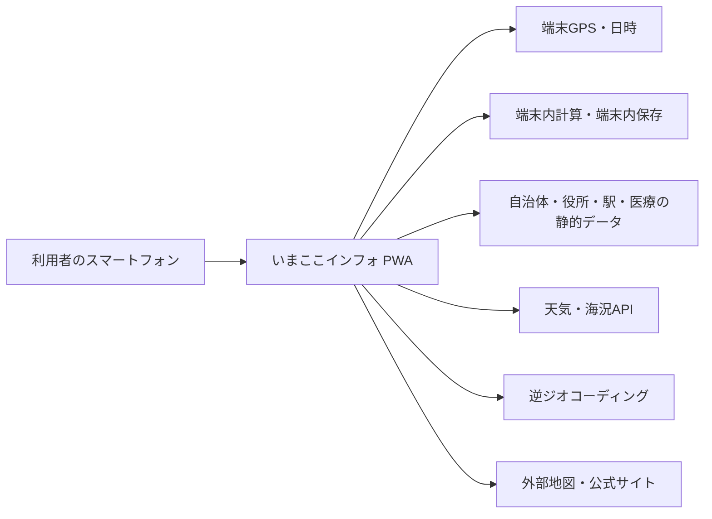

# シクミラボ「いまここインフォ」要件定義書

## 0. 文書情報

| 項目 | 内容 |
|---|---|
| 文書名 | シクミラボ「いまここインフォ」要件定義書 |
| 文書ID | IKI-REQ-001 |
| 版 | 1.8 |
| 作成日 | 2026-08-11 |
| 状態 | 要件合意済み・MVP実装済み・本番公開済み |
| 対象 | 非商用PWA「いまここインフォ」のMVP |
| 作成者 | ユーザー／Codex |
| 前提資料 | 構想たたき台「いまここ情報盤（仮称）」 |

### 表記ルール

- タグなしの記述は、要件確認で合意した内容を示す。
- 【想定】は、要件を満たすための妥当な仮置きであり、基本設計で確定する。
- 【要確認】は、実装開始前または公開前に決定・確認が必要な事項を示す。
- 【失効】は、構想段階の案が後続判断で無効になったことを示す。

## 1. 目的と背景

### 1.1 目的

端末のGPSから現在地を取得し、起動時点の日時、地名、行政区域、概算標高、都道府県庁・管轄役所、最寄り駅、天気、日の出・日の入り、概算潮汐、近隣医療機関を一画面で確認できるPWAを提供する。

利用者が地図アプリ、天気アプリ、自治体サイト、潮汐サイト、医療機関検索を個別に開く手間を減らし、「今いる場所の概況」を短時間で把握できる状態を目指す。

### 1.2 現在の行動と課題

- 現在は主に地図アプリと天気アプリを使い、必要に応じて別サイトを追加検索している。
- 情報が複数のサービスに分散し、初めて訪れた場所や海辺で確認に手間がかかる。
- 本システムがなくても重大な支障は起きないが、複数サイトを確認する手間は残る。
- 対象利用者へのインタビューは、現時点では実施していない。

### 1.3 価値仮説と反証条件

価値仮説は、「現在地に関する主要情報を一画面へ集約すると、既存の地図アプリと天気アプリを使う場合より、確認時間と操作の手間が減る」である。

次の場合、本システムの継続開発または機能追加を見直す。

- 既存アプリを使う場合と比べ、確認時間または操作回数が減らない。
- 一画面に集約した結果、情報量が多すぎて必要な情報を見つけにくい。
- 無料サービスの条件内で、安全性またはデータ鮮度を維持できない。

## 2. サービスの位置づけ

### 2.1 正式名称

- 運営屋号: シクミラボ（英字表記: SIKUMI LAB）
- サービス名: いまここインフォ
- 画面の主タイトル: いまここインフォ
- ヘッダー補助表記: © 2026 SIKUMI LAB
- 文書やプロジェクトの識別上は「シクミラボ『いまここインフォ』」と併記してよいが、画面の主タイトルへ屋号を前置しない。
- 「イマココ」単体では類似する公開サービスが複数あるため、ロゴ、画面、文書では原則として正式サービス名を省略しない。
- 公開前にJ-PlatPatで文字商標および称呼の最終確認を行う。簡易検索結果は商標上の利用可否を保証しない。

### 2.2 利用範囲

- 非商用とする。
- アカウント登録、ログイン、広告、アクセス解析は設けない。
- URLへアクセスできる人は誰でも利用でき、認証や招待制にはしない。
- 検索エンジンへの登録を積極的に行わず、URLを知る人を主な利用者とする。
- 偶然URLへ到達した人の利用は妨げない。
- 検索結果への非掲載は保証できないことを運用上の前提とする。

### 2.3 想定利用者

- 作者本人、家族、知人
- 旅行、出張、散歩、海辺への外出などで現在地の概況を知りたい人
- 日本国内で日本語を利用するスマートフォン利用者

### 2.4 ステークホルダー

| 区分 | 役割・関心 |
|---|---|
| 利用者 | 現在地の概況を短時間かつ安全に確認する。位置情報を許可・削除・共有する主体 |
| シクミラボ運営者 | 開発、公開、無料利用条件の確認、アプリと静的データの更新、障害時の停止・復旧 |
| 外部データ提供者 | 天気、海況、地名、行政、鉄道、医療等の原典を、それぞれの利用条件で提供 |
| 外部サイト運営者 | 役所、医療機関、地図等の詳細・最新情報を提供。本PWAからリンクされる |

## 3. 対象範囲

### 3.1 MVPに含めるもの

- インストール可能な静的PWA
- GPSによる現在地取得と測位状態の表示
- 起動日時、取得日時、更新日時の表示
- 都道府県、市区町村等の地名・行政区域表示
- 都道府県庁と管轄役所の案内
- 現在の天気、今日の予報、直近6時間の簡易予報
- 日の出・日の入り
- 海辺における概算の満潮・干潮時刻
- 旅客鉄道・軌道の最寄り駅と次候補
- 近隣の病院・一般診療所、および折りたたみ式のその他医療施設情報
- 外部の公式サイト・地図へのリンク
- 読み込み、部分的な失敗、再試行、前回値、オフラインの表示
- 表示内容の共有・コピー
- 端末内の前回データと設定の保存・全消去
- 出典、免責、データ基準日、アプリバージョンの表示

### 3.2 MVPに含めないもの

- ユーザー登録、ログイン、クラウド同期、複数端末同期
- 行動履歴、位置履歴、訪問地点一覧
- 住所または座標の手入力による地点検索
- アプリ内の埋め込み地図
- App Store、Google Playへのネイティブアプリ配布
- リアルタイムの道路交通、公共交通の運行情報・時刻表、店舗混雑
- 医療機関の「現在診療中」「救急受入可能」の独自判定
- 航海、漁業、防災判断に使える精密潮汐
- 有料API、有料ホスティング、新規ドメイン購入
- 管理画面、独自データベース、独自APIサーバー

### 3.3 将来候補

- 標高
- 月齢、月相、月の出・月の入り、薄明
- UV、視程、気圧、露点、熱中症・凍結の注意目安
- 波高、波向、周期、海面水温
- 最寄り避難所、ハザードマップ、気象警報への導線
- 市区町村の人口・面積等のミニ統計
- 住所・座標による手入力検索
- 気象庁観測地点を使った精度重視の潮汐表示

## 4. システム概要

### 4.1 基本構成

本システムは、ブラウザ上で動作するフロントエンドのみの静的PWAとする。端末のGPS、端末内計算、静的マスターデータ、外部の無料APIを組み合わせる。

### 4.2 前提条件

- 位置情報の新規取得には、HTTPS、GPS対応端末、利用者の許可が必要である。
- 天気、海況、逆ジオコーディングの新規取得にはインターネット接続が必要である。
- オフライン時はアプリ画面と期限内の前回値を表示できるが、最新情報は保証しない。

## 5. 機能要件

### 5.1 機能一覧

全機能IDはMVPの必須要件（優先度P0）とする。実装順は基本設計のタスクで分割するが、限定公開の受入時点ではFR-001〜FR-017をすべて満たす。

| ID | 目的 | 優先度 |
|---|---|---|
| FR-001 | URLだけで利用でき、対応端末では初回案内からホーム画面またはアプリ一覧へ追加できるようにする | P0／MVP必須 |
| FR-002 | 利用者の同意を得て現在地を取得し、再取得可能にする | P0／MVP必須 |
| FR-003 | 「今どこにいるか」を地名・行政区域として理解できるようにする | P0／MVP必須 |
| FR-004 | 現在値・取得値・前回値の時点を混同させない | P0／MVP必須 |
| FR-005 | 現在と今日の天気を一画面で把握できるようにする | P0／MVP必須 |
| FR-006 | 日没までの時間など屋外行動の目安を示す | P0／MVP必須 |
| FR-007 | 海辺で潮の上下を概算として素早く把握できるようにする | P0／MVP必須 |
| FR-008 | 管轄役所と都道府県庁の公式情報へ迷わず到達できるようにする | P0／MVP必須 |
| FR-009 | 周辺の医療機関候補と公式確認先へ到達できるようにする | P0／MVP必須 |
| FR-010 | 待ち時間中も進行状況が分かり、不安なく操作を続けられるようにする | P0／MVP必須 |
| FR-011 | 無駄な通信を抑え、短時間の再起動と一時的な通信不良に耐える | P0／MVP必須 |
| FR-012 | 一部障害で全画面を失わず、安全な回復先を提供する | P0／MVP必須 |
| FR-013 | 位置情報を不用意に漏らさず、表示内容や公式情報を共有できるようにする | P0／MVP必須 |
| FR-014 | 利用者が端末内の位置・表示データを自分で削除できるようにする | P0／MVP必須 |
| FR-015 | データの出典、鮮度、免責、アプリ版を確認可能にする | P0／MVP必須 |
| FR-016 | 現在地から利用しやすい最寄り駅と次候補を把握し、地図へ移動できるようにする | P0／MVP必須 |
| FR-017 | 現在地のおおまかな標高を追加通信なしで把握できるようにする | P0／MVP必須 |

| ID | 機能 | 要件・受入条件 | 非採用・拒否条件 |
|---|---|---|---|
| FR-001 | PWA起動・導入 | HTTPSで起動し、対応端末でホーム画面またはアプリ一覧へ追加できる。初回位置説明の完了後、未導入・未確認の場合だけ、iOS／iPadOSではSafariの共有から「ホーム画面に追加」する手順を、Android／PCではブラウザが`beforeinstallprompt`を提供した場合にインストール操作を案内する。閉じるか操作した記録は端末内に保存し、standalone起動済みまたは非対応ブラウザでは表示しない。アプリ名・アイコン・テーマ色を持つ。通常アイコンは角丸外を透過し、切り抜き用途のmaskableアイコンは背景全面を塗った別資産とする。 | HTTPSでない、追加後に単独起動できない、初回位置説明へ重なる、非対応ブラウザで偽のインストール操作を出す、案内が毎回繰り返される、または通常アイコンの四隅に意図しない白地が残る場合は受入不可。 |
| FR-002 | 位置情報取得 | 初回は「現在地で表示」操作後に許可を求める。許可済みの次回以降は起動時に自動取得し、手動更新もできる。測位精度と取得時刻を表示する。 | 初回説明なしに許可ダイアログを出す、または拒否後に再試行方法がない場合は受入不可。 |
| FR-003 | 現在地・行政区域 | 都道府県、市区町村等、地名、GPS精度を表示する。行政境界付近では誤判定の可能性を示す。逆ジオコーディング失敗時も座標または取得済みカードを残す。 | 地名取得の失敗で画面全体が使用不能になる場合は受入不可。 |
| FR-004 | 日時表示 | ヘッダーに現在の日付と時計を日本時間で常時表示する。時計は画面表示中に少なくとも分単位で追従し、日付はJSTの0時に切り替える。起動時刻、GPS確定時刻、各情報の更新時刻は現在時刻と区別して表示する。 | 現在の日付・時計がない、時計が停止する、UTC日付で切り替わる、更新時刻が不明、または前回値を現在値のように表示する場合は受入不可。 |
| FR-005 | 天気 | 現在の天気・気温・体感温度を表示する。今日の最高／最低気温と最大1時間予想降水量を表示し、直近6時間予報は時刻ごとの気温・天気状態・直前1時間の予想降水量を折りたたみ表示とする。 | データ取得時刻が表示されない、予想降水量を観測値または降水確率として表示する、時刻ごとの天気状態が判別できない場合は受入不可。 |
| FR-006 | 日の出・日の入り | 現在地と対象日から日の出・日の入りを日本時間で表示する。 | 対象日・場所が不明な値、またはタイムゾーンが誤っている場合は受入不可。 |
| FR-007 | 概算潮汐 | 利用可能な海洋データ地点が現在地からおおむね30km以内にある場合だけ、満潮・干潮の目安を表示する。地点名または基準位置、距離、予測・概算であること、航海・防災用途不可を明示する。 | 内陸で無条件に表示する、正確な潮汐として断定する、または基準地点が不明な場合は受入不可。 |
| FR-008 | 役所案内 | 都道府県庁および管轄市区町村の役所について、名称、直線距離、方角、公式サイト、外部地図リンクを表示する。 | MVPで住所、電話番号、開庁時間の収集を必須化する、または非公式サイトを公式として案内する場合は受入不可。 |
| FR-009 | 近隣医療機関 | まず半径10km以内を検索し、不足時は30kmまで広げる。病院と一般診療所を各3件まで距離順で表示し、その他区分は折りたたむ。名称、施設種別、直線距離、方角、公式サイトまたは医療情報ネット、外部地図リンクを表示する。 | 「現在診療中」「救急受入可能」を独自判定する、またはデータ基準日と確認導線がない場合は受入不可。 |
| FR-010 | 読み込み表示 | スケルトン、進捗文言、カードごとの読み込み状態を表示する。取得できたカードから順次表示し、待機中でも操作不能にしない。20秒程度を超えた項目には失敗理由、再試行、前回値の選択肢を示す。 | 無表示のまま待たせる、全項目が揃うまで画面を空白にする場合は受入不可。 |
| FR-011 | 更新・キャッシュ | 同じ地域で15分以内に取得した情報は再利用できる。手動更新では新規取得を試みる。前回の位置と表示結果は最大24時間だけ保存し、期限と取得時刻を明示する。 | 期限切れ情報を無表示で現在値として使う、または更新操作がない場合は受入不可。 |
| FR-012 | 失敗・オフライン | APIごとに失敗を分離し、取得できたカード、期限内の前回値、再試行ボタンを表示する。位置情報拒否時は端末設定の見直し方法を案内する。 | 1つの外部サービス障害で画面全体がエラーになる場合は受入不可。 |
| FR-013 | 共有・外部導線 | Web Share API対応端末では共有を、非対応端末ではコピーを提供する。共有本文に地名、時刻、選択した表示情報を含め、緯度経度は初期状態で含めない。役所・医療機関は公式サイトと外部地図を開ける。 | 利用者の明示操作なしに緯度経度を共有本文へ含める場合は受入不可。 |
| FR-014 | 保存データ削除 | 設定画面または画面下部から、前回位置、表示結果、キャッシュ、設定を端末内から全消去できる。削除完了を通知する。 | 再インストール以外に消去方法がない場合は受入不可。 |
| FR-015 | 出典・版表示 | アプリ版、静的データの基準日、主要なデータ提供元、免責事項を画面下部または情報画面へ表示する。 | 医療・行政・駅・潮汐データの基準や出典が確認できない場合は受入不可。 |
| FR-016 | 最寄り駅 | 現在地から30km以内にある旅客鉄道・軌道の駅を直線距離順で検索し、最寄り1駅を主表示、次の2駅を折りたたみ表示する。駅名、路線名、運営会社、直線距離、方角、外部地図リンクを示し、複数路線の同一駅はまとめる。 | 廃止駅・原典で休止と確認できる駅・貨物駅・信号場・索道を候補として表示する、直線距離を徒歩距離と誤認させる、またはデータ基準日と出典が確認できない場合は受入不可。 |
| FR-017 | 概算標高 | Open-Meteo Weather APIの既存応答に含まれる標高を現在地カードへ「標高 約○m（概算）」として表示する。90m解像度の地形モデル由来であり、追加API通信を行わず、防災・登山・測量用途には使えないことを出典・免責で示す。 | GPS端末の高度値として断定する、精密な海抜として表示する、標高だけのために追加通信する、または天気取得失敗で現在地カード全体を失敗させる場合は受入不可。 |

【失効】FR-005で定めていた今日・時間別の降水確率表示は、決定論的な天気状態と広域アンサンブル確率が同じ時刻欄で矛盾して見えるため、2026-08-17に廃止した。Open-Meteoの同一Weather API応答から取得する1時間予想降水量へ置き換え、追加通信は行わない。

### 5.2 基本利用フロー

1. 利用者がURLまたはホーム画面アイコンから起動する。
2. 初回は、利用目的、位置情報の使い方、外部送信の概要を表示する。
3. 利用者が「現在地で表示」を押し、位置情報を許可する。
4. 位置取得中はスケルトンと進捗を表示する。
5. GPS確定後、日時・地名・天気・太陽・行政・駅・医療・潮汐を並行して取得または計算する。
6. 取得できたカードから順次表示する。
7. 取得不能なカードは個別エラーと再試行を表示し、他のカードは維持する。
8. 利用者は更新、共有、外部サイトへの移動、保存データの削除を行える。

### 5.3 位置情報を取得できない場合

- 許可拒否: 理由と端末設定の見直し方法、再試行を表示する。
- タイムアウト: 測位中であることを示し、20秒程度で再試行または24時間以内の前回値を選べるようにする。
- 精度不足: 測位精度を表示し、再取得を案内する。
- 非対応端末: 利用できない理由を表示する。
- 住所・座標の手入力はMVPに含めず、将来候補とする。

### 5.4 医療情報の安全表示

- 距離は直線距離であり、移動距離や所要時間ではないことを示す。
- 掲載情報は公式オープンデータの基準日時点であり、最新状況を保証しない。
- 受診前に医療情報ネット、施設公式サイト、または電話で確認するよう案内する。
- 緊急時は本機能で施設を選ばず、119番を優先する旨を表示する。
- 施設の診療中・休診・受付終了・救急受入状況をアプリ側で断定しない。

### 5.5 潮汐情報の安全表示

- 海面高度等の時系列から極大・極小を求めた概算値として扱う。
- 「満潮の目安」「干潮の目安」と表記する。
- 現在地点そのものではなく、近隣の海洋モデル地点を基準とする。
- 航海、漁業、防災、遊泳可否の判断には使用しないよう明示する。
- 30km以内に利用可能な地点がない、または海洋データを取得できない場合は潮汐カードを表示しないか、利用不能の理由を表示する。

### 5.6 最寄り駅情報

- 国土交通省「国土数値情報（鉄道時系列データ）」のうち、データ基準日時点で現存扱いの旅客駅をビルド時に静的データ化する。
- 同データは休止駅も整備対象に含むため、原典の変遷備考等で休止と確認できる駅は候補から除外し、表示情報が現在の営業を保証しない旨を示す。
- 鉄道、地下鉄、路面電車、モノレール等の旅客駅を対象とし、貨物駅、信号場、操車場、索道は対象外とする。
- 距離は直線距離であり、徒歩距離、所要時間、乗車の可否を示すものではないことを明示する。
- 時刻表、運行状況、改札・出口、バリアフリー設備はMVPで表示しない。必要な場合は外部地図または鉄道事業者サイトで確認する。
- 30km以内に候補がない場合は「30km以内に駅は見つかりませんでした」と表示する。
- 棄却条件: 利用テストで駅情報が「今いる場所の概況」把握に使われず、カード追加による情報過多の悪影響が上回る場合はMVPから外す。

## 6. 画面・操作要件

### 6.1 画面構成

MVPは一画面を基本とし、情報を次の順でカード表示する。

ヘッダーでは、主タイトル「いまここインフォ」の直下に「© 2026 SIKUMI LAB」を小さく控えめに表示し、その下に現在の日付と時計を表示する。現在時計と情報の最終更新時刻は別の表示として識別できるようにする。

【失効】旧順序では、最寄り駅を潮の目安より後に配置していた。

1. 現在地、日時、GPS精度、概算標高、更新状態
2. 最寄り駅
3. 現在の天気と今日の予報
4. 日の出・日の入り
5. 概算潮汐（対象地点のみ）
6. 都道府県庁・管轄役所
7. 近隣医療機関
8. 更新、共有、保存データ削除、出典、バージョン

情報量の多い直近6時間予報、最寄り駅の次候補、医療機関の追加区分は折りたたみ式にする。

### 6.2 読み込み演出

- 初期表示直後に画面骨格を表示する。
- GPS取得、地名判定、天気、行政、駅、医療、潮汐の状態をカード単位で示す。
- 完了したカードは待機中カードより先に操作可能にする。
- 読み込みアニメーションだけに依存せず、「現在地を確認中」等の文言を併記する。
- 点滅が強い演出や、利用者が停止できない過度な動きを避ける。

### 6.3 表示形式

- 現在日付: YYYY年M月D日（曜）。JSTの0時に切り替える。現在時計と同じ文字サイズ・太さで表示する。
- 現在時計: 24時間表記のHH:mm。画面表示中は少なくとも毎分更新する。
- 取得・更新時刻: 24時間表記のHH:mmを基本とし、「現在」「GPS取得」「更新」等の意味をラベルで区別する。
- タイムゾーン: 日本標準時（JST）
- 距離: 1km未満はm、1km以上はkmを基本とする。
- 方角: 8方位と矢印を併記する。
- 取得時刻、予報時刻、データ基準日を混同しない表示とする。
- 画面フォント: 小杉ゴシック（Kosugi Gothic）をアプリへ同梱して使用し、読み込めない場合は日本語サンセリフ系システムフォントへフォールバックする。実行時に外部フォント配信へ接続しない。

## 7. データ要件

### 7.1 データ分類

| データ | 主な項目 | 保存場所 | 保存期間・更新 |
|---|---|---|---|
| 現在地スナップショット | 緯度、経度、精度、取得時刻 | 利用端末 | 最新1件のみ、最大24時間。新規取得時に置換 |
| 表示スナップショット | 地名、天気、太陽、潮汐、行政、駅、医療の表示結果と取得時刻 | 利用端末 | 最新1件のみ、最大24時間 |
| 短期キャッシュ | API応答または表示用整形値 | 利用端末 | 同じ地域では15分を有効目安とする |
| 利用設定 | 初回説明確認、折りたたみ状態等 | 利用端末 | 全消去まで |
| 自治体・役所マスター | 自治体コード、庁舎名、座標、公式URL、更新日 | 配布する静的ファイル | 半年ごとに確認、変更時に更新 |
| 駅マスター | 駅ID、駅名、路線名、運営会社、座標、設置期間、データ基準日 | 地域分割した静的ファイル | 年1回公開状況を確認し、公式版更新時に反映 |
| 医療機関マスター | 施設ID、種別、名称、座標、公式URL等 | 地域分割した静的ファイル | 月1回公開状況を確認し、公式版更新時に反映 |
| アプリ資産 | HTML、CSS、JavaScript、アイコン等 | PWAキャッシュ | アプリ版更新時に切替 |

### 7.2 保存原則

- 位置情報の履歴は作成しない。最新1件を上書きする。
- サーバー側へ利用者の位置情報、閲覧履歴、識別子を保存しない。
- Cookieは利用しない。
- アクセス解析、広告計測、行動追跡SDKを導入しない。
- 保存期間を過ぎた位置・表示スナップショットは、次回起動時または定期処理で削除する。
- 全消去では、サービスワーカーが管理する再取得可能なアプリ資産を除き、利用者由来の保存データを削除する。

### 7.3 医療データの加工

- 厚生労働省「医療情報ネット」オープンデータを開発時に取得し、全国CSVを地域グリッド単位の小さな静的JSONへ変換する。
- PWAは現在地周辺に必要なファイルだけを読み込む。
- 施設までの距離と方角は端末内で計算する。
- 原典の施設IDとデータ基準日を保持し、更新・追跡可能にする。
- 加工処理は再実行可能にし、変換件数、欠損座標、重複IDを検査する。

### 7.4 駅データの加工

- 国土交通省「国土数値情報（鉄道時系列データ）」を開発時に取得し、データ基準日時点で現存する旅客駅を地域グリッド単位の静的JSONへ変換する。
- 駅名、路線名、運営会社、駅座標、設置期間、関係ID、データ基準日を保持する。
- 同名かつ近接する複数路線の駅レコードを表示用の駅グループへまとめ、路線と運営会社を重複排除する。
- 現在地からの距離と方角は端末内で計算し、駅検索のために現在地を外部送信しない。
- 変換件数、廃止年、重複ID、座標範囲、グルーピング結果を検査する。

### 7.5 データ互換性

- アプリ版と静的データ版を別々に識別できるようにする。
- 保存形式を変更する場合は移行処理を用意するか、安全に旧データを破棄して再取得する。
- 不整合なキャッシュで画面が停止しないことを優先する。

## 8. 外部連携要件

| 連携先 | 用途 | 利用方針 | 障害時 |
|---|---|---|---|
| ブラウザ Geolocation API | 現在地取得 | HTTPS、明示許可、最新1件のみ保存 | 理由、再試行、前回値を表示 |
| Open-Meteo Weather API | 天気、今日・短時間予報、日の出・日の入り | 非商用無料枠、必要項目を一括取得、出典表示 | 天気カードのみ個別エラー、前回値を表示 |
| Open-Meteo Marine API | 概算潮汐 | 近隣海域のみ、目安・免責を表示 | 潮汐カードを非表示または個別エラー |
| 国土地理院 逆ジオコーダー | 座標から地名・自治体コードを取得 | HTTPS・CORS応答を検証し、丸めた座標だけを送信して出典表示する | 座標と取得済みカードを残し、地名のみエラー |
| 自治体・役所の公式情報 | 庁舎マスター作成 | 自治体コードをキーに静的データ化、公式URLを使用 | 前版へ戻し、更新日を表示 |
| 国土交通省 国土数値情報（鉄道時系列データ） | 最寄り駅マスター | 非商用条件と出典表示を守り、ビルド時に現存旅客駅だけを地域分割して静的データ化 | 前版のデータを基準日付きで継続利用 |
| 厚生労働省 医療情報ネット | 医療機関マスター | 公式オープンデータを加工し、出典・基準日を表示 | 前版のデータを期限・基準日付きで継続利用 |
| 外部地図・公式サイト | 経路・詳細確認 | アプリ内に地図を埋め込まず外部リンクとする | リンク単位で利用不能を表示 |
| Cloudflare Pages | 静的PWA配信 | 無料枠、所有済み独自ドメイン、HTTPS | 前版へロールバック |

### 8.1 位置情報の外部送信

- 生のGPS値は端末内の距離・方角計算に使う。
- 外部サービスには、その用途に不要な高精度の座標を送らない。
- 端末保存と国土地理院への送信は緯度経度を小数点以下4桁、天気・海況への送信は小数点以下2桁に丸める。
- 初回説明またはプライバシー表示で、送信先、目的、保存方針を明記する。

## 9. 非機能要件

### 9.1 性能

| ID | 要件 |
|---|---|
| NFR-P01 | PWAの画面骨格と保存済み情報は、一般的な4G／Wi-Fi環境で起動後2秒以内の表示を目標とする。 |
| NFR-P02 | GPS確定後、取得可能な主要カードを20秒程度以内に表示することを目標とする。 |
| NFR-P03 | 20秒を超える処理は待機を続けるだけにせず、カード単位で再試行または前回値を提示する。 |
| NFR-P04 | 同一地域・15分以内のキャッシュを利用し、不要なAPI呼び出しを避ける。 |

性能値は無料の外部APIや端末GPSの応答を保証するものではない。外部要因で未達の場合も、利用者が状況と次の操作を理解できることを必須とする。

### 9.2 可用性・復旧性

- 稼働率SLAは設けない。
- 外部APIの一部停止時にも、影響のないカードと期限内の前回値を利用できる。
- 静的配信の前版へ戻せること。
- 医療・役所・駅データの更新失敗時は、検証済みの前版を維持する。
- オフライン時はアプリ画面、免責、期限内の前回表示を利用可能にする。

### 9.3 セキュリティ

- 全ページをHTTPSで配信する。
- APIキーや秘密情報をフロントエンドへ埋め込まない。MVPでは秘密鍵を必要とするサービスを採用しない。
- 外部から取得した文字列を安全に表示し、HTMLとして無条件に展開しない。
- 外部リンクは安全な属性とURL検証を用いる。
- Content Security Policyで、許可する接続先と資産を制限する。
- 依存ライブラリを最小化し、公開前と更新時に既知の重大な脆弱性を確認する。

### 9.4 プライバシー

- アカウント、広告Cookie、アクセス解析を使わない。
- 位置履歴を作成しない。
- 最新1件の位置・表示結果だけを端末内へ最大24時間保存する。
- 緯度経度を共有情報へ初期状態で含めない。
- 端末内保存データを利用者が全消去できる。
- 利用する外部サービスと位置情報送信の目的を明示する。

### 9.5 アクセシビリティ・使いやすさ

- 主要操作のタッチ対象は44px四方以上を目安とする。
- 文字と背景に十分なコントラストを確保する。
- ダークテーマでも主要カードのアイコン、駅・役所・医療の操作文字、役所名を判読可能にし、実効背景とのコントラスト比4.5:1以上を受入目安とする。
- 成功・警告・失敗を色だけで区別しない。
- 端末の文字サイズ設定と拡大表示に追従する。
- 読み込み、エラー、更新完了を文字でも通知する。
- キーボード操作とフォーカス表示を妨げない。
- 動きを減らす端末設定を尊重する。

### 9.6 対応環境

- 主対象はスマートフォンとする。
- 公開時点の現行および一世代前のiOS Safari、Android Chromeを主な確認対象とする。
- PCの最新Chrome、Edge、Safariでは閲覧と主要操作ができることを目標とする。
- GPS、PWA追加、共有等の機能差は段階的機能低下で扱い、非対応機能のために画面全体を停止しない。

### 9.7 費用

- 開発作業を除く新たな固定費を0円とする。
- 所有済み独自ドメインを使い、新規ドメインを購入しない。
- Cloudflare Pages等の無料枠を使い、有料枠へ自動移行しない。
- 無料枠または非商用条件を超える見込みが生じた場合は、課金せず、公開範囲・更新頻度・対象機能を見直す。

### 9.8 保守性

- 天気、海況、逆ジオコーディングは提供元ごとに交換可能な境界を設ける。
- 自治体・駅・医療データの取得・変換・検証を再実行可能にする。
- 画面カードごとに処理と失敗を分離する。
- 出典、利用条件、データ更新手順をリポジトリ内文書に残す。

## 10. 公開・運用要件

### 10.1 公開方法

- 所有済み独自ドメインのサブドメインまたは配下パスを使用する。
- 【要確認】実際のホスト名はT-018の公開準備で確定する。T-001からの実装開始は妨げない。
- 認証は設けない。
- 検索エンジン向けのnoindex指定を行い、サイトマップや主要サイトから積極的にリンクしない。
- noindexは秘密保持やアクセス制限ではなく、URLを知る人や偶然到達した人は利用できる。

### 10.2 リリース管理

- 【失効】`iki-MAJOR.MINOR.PATCH`形式を使い、初期MVPを`iki-0.1.0`とする。
- `mvp-MAJOR.MINOR.PATCH`形式を使い、初期MVPを`mvp-0.1.0`とする。
- 画面下部にアプリバージョンを表示する。
- 本番反映前にプレビュー環境で受入確認を行う。
- 問題発生時に直前の正常版へ戻せるようにする。
- アプリ更新時に旧キャッシュとの不整合を検出し、安全に再取得する。

### 10.3 定期作業

| 頻度 | 作業 |
|---|---|
| 月1回 | 医療情報ネットの新しいオープンデータ公開有無を確認する。 |
| 公式版更新時 | 医療データを再取得・変換・検証し、基準日を更新する。 |
| 年1回 | 国土数値情報の鉄道時系列データ新版を確認し、公開済みなら駅データを再生成・検証する。 |
| 半年ごと | 都道府県庁・市区町村役所の名称、座標、公式URLを確認する。 |
| アプリ更新時 | 対応ブラウザ、PWA更新、外部API、出典、免責、無料利用条件を確認する。 |
| 障害・報告時 | 影響するカードを切り分け、必要に応じて機能停止または前版へ戻す。 |

### 10.4 運用責任

- 【想定】シクミラボの運営者が公開、データ更新、外部サービス条件確認を行う。
- 【想定】専用の利用者サポート窓口や応答時間保証は設けない。
- 利用不能が長期化しても有料サービスへ自動移行せず、停止または代替手段を検討する。

## 11. 開発・表示標準

### 11.1 実装標準

- 静的ホスティングで完結する構成を優先する。
- 位置、日時、距離、方角の計算は共通関数へ集約し、テスト可能にする。
- 外部API応答を画面へ直接結び付けず、正規化した内部形式を介する。
- UI状態は、未開始、取得中、成功、前回値、期限切れ、失敗、対象外を区別する。
- 提供元別のタイムアウトと再試行を設け、無限再試行を行わない。
- ログへ位置情報を出力しない。本番のブラウザコンソールにも不要な位置情報を残さない。

### 11.2 画像・アイコン

- MVPに利用者画像の投稿・保存機能はない。
- 装飾画像は必須とせず、必要な場合は軽量なSVGまたは適切に圧縮した画像を使う。
- 情報の意味をアイコンだけに依存させず、文字ラベルを併記する。

### 11.3 日時入力

- MVPに利用者が日時を入力する機能はない。
- 表示する日時はJSTへ統一し、APIのUTC値を正しく変換する。
- 将来、日付選択を追加する場合は、端末の標準日付入力と入力検証を使う。

### 11.4 テスト標準

- 距離、方角、時刻変換、日の出・日の入り、潮汐の極値抽出を自動テストする。
- 外部API成功、タイムアウト、不正応答、部分欠損を再現できるようにする。
- 医療・役所・駅マスターの件数、ID重複、座標範囲、必須項目を検査する。
- 実機で位置許可、拒否、再試行、オフライン、ホーム画面追加、PWA更新を確認する。

## 12. 制約・前提

- 日本国内、日本語、JSTに限定する。
- 非商用の無料利用条件を守る。
- 外部APIに稼働保証はない。
- 独自のバックエンド、データベース、利用者管理を持たない。
- 地図は外部サービスへのリンクとし、埋め込まない。
- 医療・行政データの正確性と最新性を保証しない。
- 潮汐は概算であり、生命・財産に関わる判断へ使用しない。
- 公開名称の簡易重複調査は完了しているが、商標調査・法的判断を意味しない。

## 13. 開発段階とスケジュール

固定の公開期限は設けず、MVPの受入条件を満たした段階で公開する。

| 段階 | 内容 | 完了条件 |
|---|---|---|
| 1. 基本設計 | 画面、データ、外部連携、キャッシュ、エラー設計 | 設計ブロッカーがなく、実装単位へ分割できる |
| 2. コア試作 | GPS、地名、日時、天気、日の出・日の入り | 実機で一画面表示と部分エラーを確認できる |
| 3. MVP拡張 | 行政、最寄り駅、医療、概算潮汐、共有、PWA、オフライン | 機能要件と安全表示を満たす |
| 4. 公開前確認 | 実機、データ、無料条件、出典、名称、独自ドメイン | 第14章の受入条件をすべて満たす |
| 5. 限定的公開 | URLを知る人向けに公開 | 重大障害なく利用でき、価値検証を開始できる |

## 14. 受入条件

### 14.1 機能受入

- ヘッダーの主タイトルが「いまここインフォ」、その直下の控えめな補助表記が「© 2026 SIKUMI LAB」である。
- 現在の日付と時計が同じ文字サイズ・太さでJST表示され、画面表示中に時計が分単位で進み、JSTの0時に日付が切り替わる。
- 画面全体で同梱した小杉ゴシックが適用され、フォント取得のための外部通信が発生しない。
- 【失効】潮の目安より後のカードを「最寄り駅、役所、医療機関」の順に表示する。
- 現在地の直後に最寄り駅を表示し、その後を「天気、太陽、潮の目安、役所、医療機関」の順に表示する。
- 天気APIが返す標高を現在地カードに「標高 約○m（概算）」として表示し、値がない場合も現在地カードの地名・GPS精度を利用できる。
- 初回説明から位置許可を行い、現在地の主要情報を一画面へ表示できる。
- 許可済み端末では次回起動時に自動更新し、手動更新もできる。
- 天気、日の出・日の入り、役所、医療機関が合意した項目数・粒度で表示される。
- 海岸側の試験地点では概算潮汐と免責が表示され、内陸側では誤表示されない。
- 医療機関は10kmから検索し、不足時に30kmへ広げ、病院・診療所を各3件まで表示する。
- 最寄り駅は30km以内から距離順に検索し、最寄り1駅と次候補2駅を、路線・運営会社・直線距離・方角・地図導線付きで表示する。
- 30km以内に旅客駅がない地点では、遠方の駅や廃止駅を最寄りとして誤表示しない。
- 共有本文へ緯度経度が初期状態で含まれない。
- 全消去後、前回位置と表示スナップショットが残らない。

### 14.2 障害受入

- 位置許可拒否、GPSタイムアウト、オフラインをそれぞれ再現し、理由と次の操作を表示できる。
- 天気、海況、逆ジオコーディングのいずれかを失敗させても、無関係なカードを利用できる。
- 24時間以内の前回値には取得時刻と前回値であることが表示される。
- 24時間を超えた前回値を現在値として表示しない。
- 20秒程度を超える読み込みには、カード単位の再試行または前回値が提示される。

### 14.3 品質受入

- 主対象のiPhone SafariとAndroid Chromeの実機で主要フローを確認する。
- 主要タッチ対象、文字拡大、コントラスト、色以外の状態表現を確認する。
- PWAをホーム画面へ追加し、単独起動と更新を確認する。
- アプリ版、医療データ基準日、役所データ更新日、駅データ基準日、出典、免責が確認できる。
- 重大または高リスクの既知不具合がない。
- 新たな固定費が発生せず、有料枠へ自動移行しない構成である。

### 14.4 安全受入

- 医療カードに受診可否を保証しない旨と、緊急時119の案内がある。
- 潮汐カードに概算、基準位置、航海・防災用途不可の表示がある。
- 位置情報の外部送信先、目的、保存期間、全消去方法を確認できる。
- 本番ログ、解析サービス、サーバー保存に位置情報が残らない。

## 15. 成功基準と評価方法

### 15.1 MVPの成功基準

- テスト利用者が、現在地、現在時刻、天気、日の入り、管轄自治体、最寄り駅を一画面から確認できる。
- 地図アプリと天気アプリを個別に使う場合に比べ、確認時間または操作回数が減る。
- 外部サービスの一部失敗時でも、取得可能な情報へ到達できる。
- 無料運用とプライバシー方針を維持できる。

### 15.2 評価方法

アクセス解析を導入しないため、評価は手動で行う。

- 【想定】作者以外の3人以上に、同じ確認課題を既存アプリと本PWAで実施してもらう。
- 現在地、天気、日の入り、役所、最寄り駅、医療機関を確認するまでの時間と操作回数を比較する。
- 情報の見つけやすさ、読み込み中の安心感、不要な情報を短い聞き取りで確認する。
- 【想定】多くの試行で時間または操作回数のどちらかが改善すれば、価値仮説を支持する。

### 15.3 見直し基準

- 改善が確認できなければ、表示項目、カード順、折りたたみ、MVPの継続を見直す。
- 医療・役所・駅データ更新の負担が価値を上回る場合は、公式検索・地図へのリンク中心へ縮小する。
- 無料APIの条件変更で0円運用が困難になった場合は、該当カードを停止し、有料化は自動で行わない。

## 16. リスクと対応

| ID | リスク | 影響 | 対応 |
|---|---|---|---|
| R-01 | GPS誤差や行政境界付近の誤判定 | 誤った自治体・役所を表示 | 精度表示、境界注意、再取得、公式地図リンク |
| R-02 | 無料APIの停止・規約変更 | 天気・潮汐・地名が取得不能 | 提供元の分離、個別エラー、前回値、機能停止 |
| R-03 | 医療情報の古さ・誤り | 誤った受診判断 | 基準日、公式確認、119案内、診療中を断定しない |
| R-04 | 役所移転・URL変更 | 誤案内・リンク切れ | 半年確認、更新日表示、自治体コード管理 |
| R-05 | 潮汐の精度誤解 | 危険な行動判断 | 概算・基準地点・用途外を常時表示 |
| R-06 | 位置情報の漏えい | プライバシー侵害 | 履歴なし、端末内最新1件、精度抑制、解析なし、全消去 |
| R-07 | 情報過多 | 一画面の価値低下 | 優先順、カード化、折りたたみ、利用テスト |
| R-08 | PWAキャッシュ不整合 | 更新後の表示停止 | 版管理、互換性確認、安全なキャッシュ破棄、ロールバック |
| R-09 | 名称の類似・商標 | 公開後の改名 | 正式名を一貫使用し、公開前にJ-PlatPatで最終確認 |
| R-10 | noindexが守られない | 想定外の検索流入 | 秘密情報を載せず、誰でも利用可能な公開サービスとして設計 |
| R-11 | 駅の新設・廃止・休止・改称が静的データへ未反映 | 古い駅や路線を案内 | 基準日表示、年次更新、公式地図導線、変遷情報の検査 |

## 17. 決定事項・未決事項

### 17.1 決定事項

- サービス名と画面の主タイトルは「いまここインフォ」とし、運営屋号「シクミラボ」は直下に「© 2026 SIKUMI LAB」として控えめに表示する。
- ヘッダーにJSTの現在日付と時計を表示し、時計は少なくとも毎分、日付はJSTの0時に更新する。
- 日本国内、日本語、JSTを対象とする。
- 非商用、広告なし、ログインなし、アクセス解析なしとする。
- 静的PWAとし、独自サーバー・DBを置かない。
- 所有済み独自ドメインと無料ホスティングを使う。
- URLは認証なしで閲覧可能だが、検索登録を積極的に行わない。
- 潮汐は30km以内の海洋モデルを使う概算表示とする。
- 医療機関は公式オープンデータを使い、病院・一般診療所を各3件表示する。
- 最寄り駅は国土数値情報の非商用データを静的加工し、30km以内の最寄り1駅と次候補2駅を表示する。駅検索のために現在地を外部送信しない。
- 役所は名称、距離、方角、公式サイト、地図リンクを表示する。
- 15分の短期キャッシュと、最大24時間の最新1件保存を使う。
- 読み込み演出を設け、20秒程度を超えた項目には次の操作を示す。
- 固定期限は設けず、受入条件を満たしてから公開する。
- 実装はReact、TypeScript、Viteを使い、PWAと自動テストを組み込む。
- コードはユーザーが作成した公開GitHubリポジトリ`gerupon-lgtm/imacoco`で管理し、Cloudflare Pagesへ連携する。
- 逆ジオコーディングは国土地理院系サービスを使用し、自治体・役所はJ-LIS等を基準に静的データ化する。
- 地名・役所・駅・医療は前回地点から250m以内、天気・海況は1km以内を同じ地域とみなし、15分間キャッシュを再利用する。
- 医療の折りたたみ区分は、歯科診療所・薬局・助産所を各3件まで表示する。
- 画面は空色・紺・海色の角丸カードを基本とし、端末設定に応じたダークモードへ対応する。
- 画面フォントはアプリへ同梱した小杉ゴシックとし、外部フォント配信へ実行時接続しない。
- 【失効】現在日付は現在時計と同じ文字サイズ・太さにし、潮の目安以降は最寄り駅、役所、医療機関の順に表示する。
- 現在日付は現在時計と同じ文字サイズ・太さにし、現在地の直後に最寄り駅、その後に天気、太陽、潮の目安、役所、医療機関を表示する。
- 【失効】現在日付と現在時計の具体的な強調度、テーマ選択・日付カード・現在地カード間の余白は画面設計に委ねる。
- 410px前後のスマートフォン幅では現在日付と現在時計を同じ18px以上の文字サイズ・太さで表示し、テーマ選択から日付カードまでと、日付カードから現在地カードまでの縦間隔を同程度に揃える。
- 概算標高は天気APIの既存応答を再利用して現在地カードへ表示し、標高専用の追加通信は行わない。

### 17.2 残る確認事項

以下はいずれもT-001からの実装開始を妨げない。

- 【要確認】使用するサブドメインまたは配下パス: T-018の公開設定前に確定する。
- 政令指定都市は区役所優先、市役所を補助導線として実装済み。
- PWAアイコンは青地の現在地ピンと方位針を組み合わせた図案に確定し、SVG・ホーム画面用PNGとして実装済み。
- 【要確認】公開前のJ-PlatPat最終確認結果: T-018の本番公開前に実施する。

### 17.3 失効した構想

- 【失効】仮称「いまここ情報盤」: 正式名称「いまここインフォ」に決定したため。
- 【失効】画面の主タイトルを「シクミラボ『いまここインフォ』」とする表記: シクミラボは運営屋号でありサービス名と分離するため。主タイトル「いまここインフォ」、補助表記「© 2026 SIKUMI LAB」へ置換する。
- 【失効】初期版での住所・座標手入力: 将来候補へ移したため。
- 【失効】役所の住所・電話・開庁時間を一画面へ表示: MVPの更新負担を抑えるため。
- 【失効】コードを非公開GitHubリポジトリで管理する: ユーザーが公開リポジトリ`gerupon-lgtm/imacoco`を作成し、そこへ公開済みのため。アプリ自体も認証なし・noindex方針で公開する。
- 【失効】新規取得情報を10秒以内に表示: 20秒程度まで許容し、読み込み演出と段階表示を重視する方針に変更したため。

## 18. 基本設計への引き継ぎ

基本設計では、次の順に具体化する。

1. 一画面の情報優先順位、カード構成、読み込み・エラー状態
2. GPS取得、初回説明、拒否・タイムアウト・再試行フロー
3. 逆ジオコーディング、天気、海況の提供元境界と内部データ形式
4. 自治体・役所・駅・医療機関の静的データ形式、分割方式、更新処理
5. 15分キャッシュ、24時間保存、全消去、PWA更新のライフサイクル
6. 医療・潮汐の免責と外部公式サイトへの導線
7. 実機テスト、受入試験、Cloudflare Pagesと独自ドメインの公開手順

## 19. 参照先

- MDN Geolocation API: https://developer.mozilla.org/en-US/docs/Web/API/Geolocation_API
- Open-Meteo料金・利用条件: https://open-meteo.com/en/pricing
- Open-Meteo Weather API: https://open-meteo.com/en/docs
- Open-Meteo Marine API: https://open-meteo.com/en/docs/marine-weather-api
- Cloudflare Pages制限: https://developers.cloudflare.com/pages/platform/limits/
- 厚生労働省 医療情報ネット オープンデータ: https://www.mhlw.go.jp/stf/seisakunitsuite/bunya/kenkou_iryou/iryou/newpage_43373.html
- 医療情報ネット（ナビイ）: https://www.iryou.teikyouseido.mhlw.go.jp/znk-web/juminkanja/S2300/initialize
- e-Stat 市区町村名・コード: https://www.e-stat.go.jp/municipalities/cities
- 国土交通省 国土数値情報（鉄道時系列データ）: https://nlftp.mlit.go.jp/ksj/gml/datalist/KsjTmplt-N05-2025.html
- 国土数値情報 利用規約: https://nlftp.mlit.go.jp/ksj/other/agreement_01.html
- J-PlatPat商標検索: https://www.j-platpat.inpit.go.jp/t0100

## 20. 改訂履歴

| 版 | 日付 | 内容 |
|---|---|---|
| 1.0 | 2026-08-11 | 構想資料と要件ヒアリングを統合。正式名称、MVP、非機能、運用、受入条件を確定。 |
| 1.1 | 2026-08-11 | 基本設計の入力品質ゲートに合わせ、全機能の目的・優先度を明記。技術、データ取得、キャッシュ、医療区分、画面方針の設計判断を反映。 |
| 1.2 | 2026-08-11 | FR-016「最寄り駅」をMVPへ追加。国土数値情報の非商用鉄道データを静的加工し、30km以内の最寄り1駅＋次候補2駅を表示する要件、受入、運用、リスクを追記。 |
| 1.3 | 2026-08-11 | 画面主タイトルを「いまここインフォ」、補助表記を「© 2026 SIKUMI LAB」に確定。FR-004へJSTの現在日付・毎分更新する時計・JST 0時の日付切替を追加。 |
| 1.4 | 2026-08-11 | 現在日付を時計と同じサイズ・太さに変更。潮の目安以降を最寄り駅、役所、医療機関の順へ変更。小杉ゴシックのアプリ同梱を確定し、基本設計で解消済みの逆ジオコーダー・座標丸め・CSP・版形式を正典へ反映。 |
| 1.5 | 2026-08-11 | FR-017「概算標高」をMVPへ追加。Open-Meteo Weather APIの既存応答に含まれる90m解像度由来の標高を追加通信なしで現在地カードへ表示し、用途外の免責を付す。 |
| 1.6 | 2026-08-11 | 実リポジトリ`gerupon-lgtm/imacoco`が公開であることを正典へ反映し、非公開GitHub要件を失効。政令指定都市の役所表示とPWAアイコンを実装済みとして確認事項から解消。 |
| 1.7 | 2026-08-11 | 本番公開済みへ状態を更新。アプリ版の接頭辞`iki-`を失効し、`mvp-`へ変更。ダークモードで主要アイコン・操作リンク・役所名を判読可能にし、天気の補足値を一列に整列する受入修正を反映。 |
| 1.8 | 2026-08-11 | FR-001へ初回のPWAインストール案内を追加。iOS／iPadOSはSafari手順、Android／PCは`beforeinstallprompt`対応時だけ操作を提示し、初回位置説明の優先、表示済み保存、standalone・非対応時の非表示を受入条件へ反映。 |
| 1.9 | 2026-08-12 | 最寄り駅を現在地の直後へ移動し、次候補を含む各駅に地図導線を必須化。通常PWAアイコンの角丸外を透過し、maskable用途を背景全面の別資産へ分離。 |
| 1.10 | 2026-08-12 | FR-005の直近6時間予報へ時刻ごとの簡潔な天気状態を追加。太陽と潮の時刻表示を同じ左右列の中心位置へ統一。 |
| 1.11 | 2026-08-12 | FR-004の日付・時計をスマートフォンで18px以上へ拡大し、テーマ選択・日付カード・現在地カード間の縦間隔を統一。 |
| 1.12 | 2026-08-17 | FR-005の降水確率表示を失効し、今日の最大1時間予想降水量と直近6時間の時間別予想降水量へ変更。単位を％からmmへ統一し、Open-Meteoへの通信回数は1回のまま維持。 |
